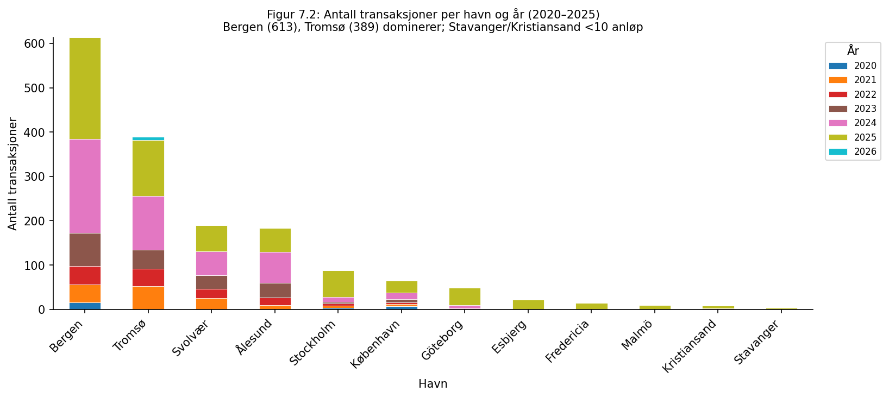
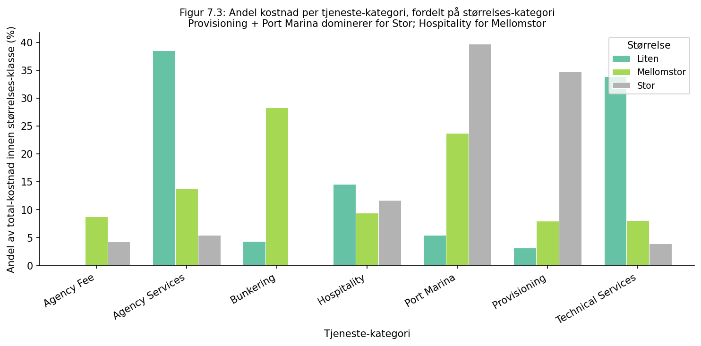
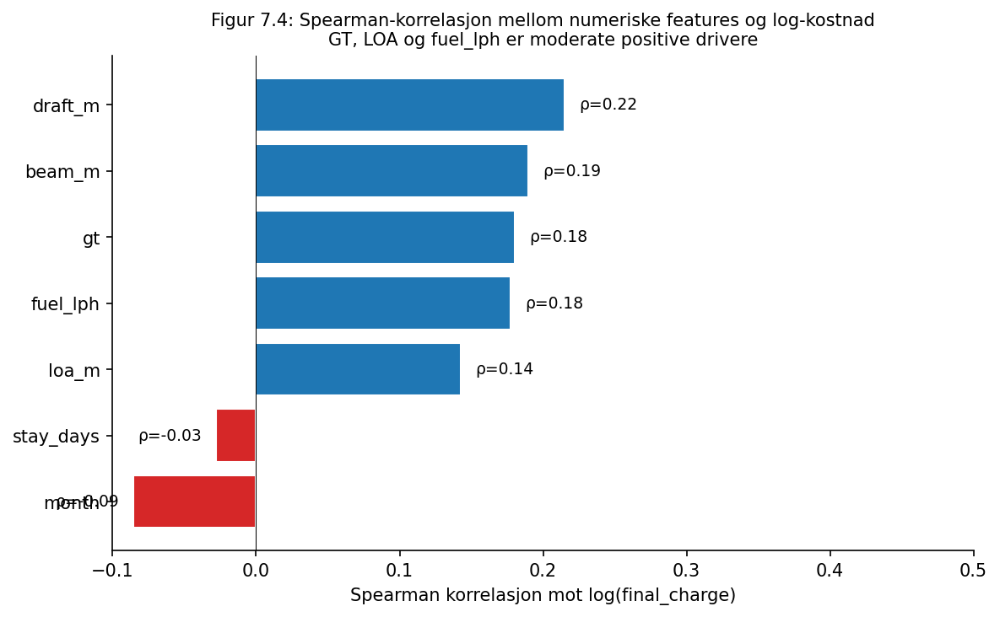
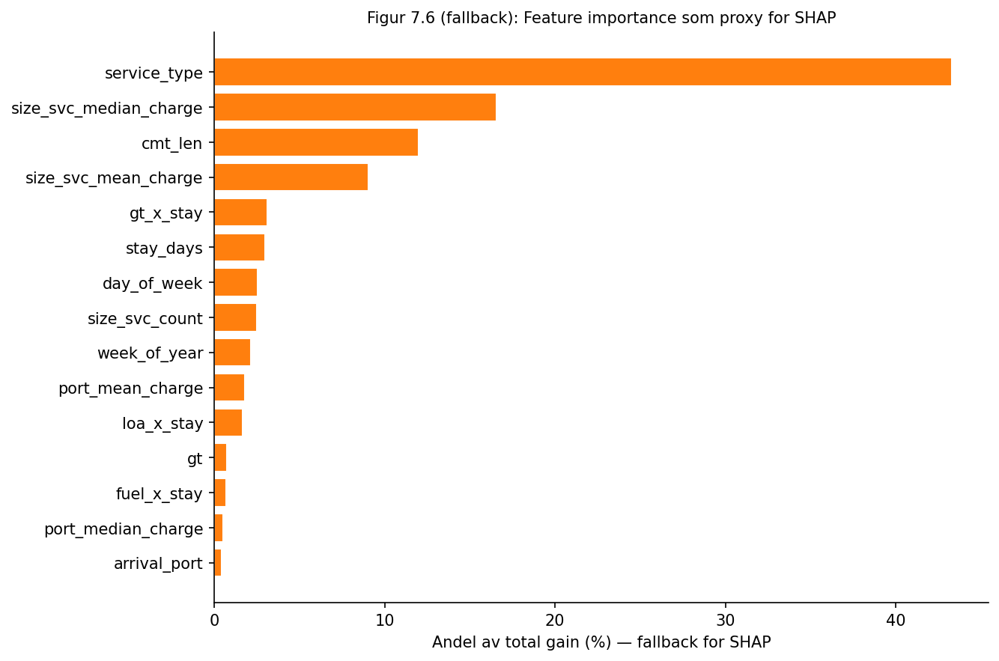
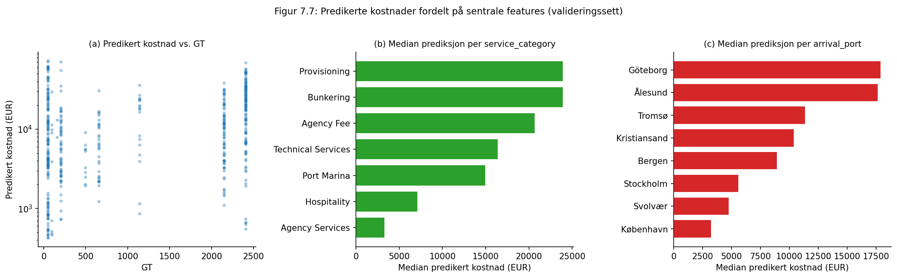
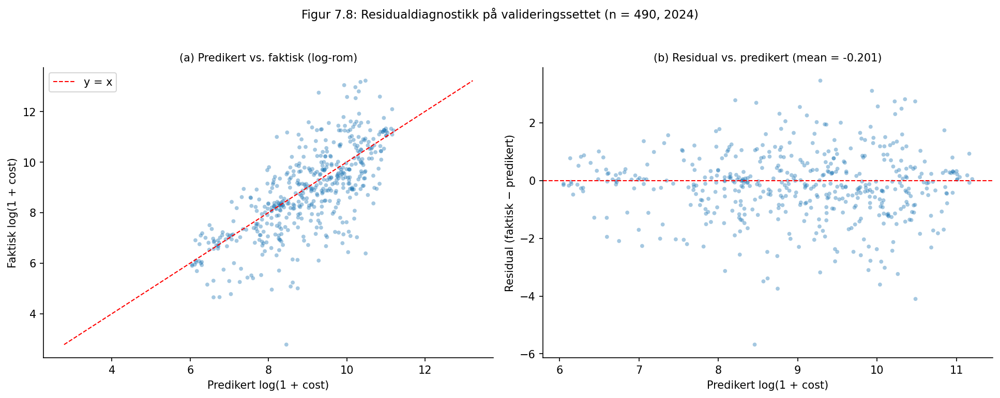

{width=4cm}

# NautiCost

*Datadreven kostnadsestimering for yachthavneanløp i Skandinavia*

LOG650 — Forskningsprosjekt, vår 2026

Gruppe 11

**Jørgen Rene** (individuell)

Veiledere: Bård Inge Pettersen · Per Kristian Rekdal · Erik Langelo

Molde, mai 2026

Høgskolen i Molde · Avdeling for logistikk

```{=openxml}
<w:p><w:r><w:br w:type="page"/></w:r></w:p>
```

## Obligatorisk egenerklæring

**Forfatter:** Jørgen Rene · **Studiepoeng:** 15 (LOG650 Forskningsprosjekt) · **Veiledere:** Bård Inge Pettersen, Per Kristian Rekdal, Erik Langelo · **Dato:** 2026-05-25 · **Antall ord (hoved­tekst, Word-stil):** ca. 12 000.

Forfatter bekrefter (1–6) jf. HiMs mal *Mal prosjekt LOG650 v2.docx*:

- ☒ (1) Besvarelsen er eget arbeid; ingen kilder eller hjelp utover det som er oppgitt.
- ☒ (2) Besvarelsen er ikke brukt til annen eksamen, refererer ikke til andres eller eget tidligere arbeid uten oppgivelse, har alle referanser i bibliografien, og er ikke kopi/duplikat av andres arbeid.
- ☒ (3) Forfatter er kjent med at brudd på (1)–(2) er fusk jf. UH-loven §§ 4-7/4-8 og Forskrift om eksamen §§ 14/15.
- ☒ (4) Forfatter er kjent med plagiatkontroll i URKUND.
- ☒ (5) Forfatter er kjent med høgskolens fuskebehandling.
- ☒ (6) Forfatter har satt seg inn i bibliotekets regler for kildebruk.

**Personvern:** Ikke meldt til NSD; faktura­data inneholder ingen direkte personopplysninger og yacht-IDer er anonymisert (`yacht_1, …, yacht_19`), jf. § 9.8. **Helseforskningsloven:** Ikke aktuelt. **Publiseringsavtale Brage HiM:** ☐ Ja ☐ Nei. **Båndlagt:** ☐ Ja ☐ Nei *(velges ved innlevering).*

---

## Sammendrag

NautiCost er et beslutningsstøtteverktøy som estimerer totalkostnaden for et superyachthavneanløp i Norge, Sverige eller Danmark før yachten ankommer. Datasettet kombinerer **670 reelle 2025-fakturaer fra SDK Shipping** (n = 649 etter feature engineering; testsettet) med **977 simulerte 2020–2024-transaksjoner** ankret i case-strukturen, koblet mot 17 yachters spesifikasjoner. Metodevalget er pensum­forankret (Pettersen & Rekdal, 2026, tabell 1.1): gradient boosting + kryssvalidering + SHAP + hyperparameter­tuning. Kostnaden modelleres på transaksjonsnivå med log-transformert mål og en LightGBM + CatBoost-ensemble. Prediksjoner aggregeres via portmaler og trafikkvekter, og kalibreres mot empiriske persentiler (P25/P50/P75) per (havn, størrelse). Kildedata er i EUR; frontend konverterer til NOK/DKK ved API-grensa. På simulert val=2024 (n = 490): **MAE = 17 350 EUR, wMAPE = 71,4 %** — 20 % bedre enn median­baseline. På det reelle 2025-testsettet (n = 649): **MAE = 19 051 EUR, wMAPE = 74,3 %** — ≈ 10 % val→test-degradering, hvor en del skyldes simulert→reell-overgangen. Modellen er pakket som FastAPI + Next.js med svar­tid under to sekunder.

---

## Abstract

NautiCost is a pre-arrival decision-support tool that estimates the total cost of a super­yacht port call in Norway, Sweden or Denmark. The dataset combines **670 real 2025 invoices from SDK Shipping** (n = 649 after feature engineering; the hold-out test set) with **977 simulated 2020–2024 transactions** anchored in the case structure, linked to 17 yachts. The methodology is curriculum-anchored (Pettersen & Rekdal, 2026, Table 1.1): gradient boosting, cross-validation, SHAP and hyper­parameter tuning. Cost is modelled per transaction with a log-transformed target and a LightGBM + CatBoost ensemble, then aggregated via port templates and traffic weights, and calibrated against empirical P25/P50/P75 percentiles per (port, size). Source data are in EUR; the frontend converts to NOK/DKK at the API boundary. On simulated 2024 validation (n = 490): **MAE = €17,350 / wMAPE = 71.4 %** — 20 % better than median baseline. On the real 2025 hold-out test set (n = 649): **MAE = €19,051 / wMAPE = 74.3 %** — a ≈ 10 % val→test degradation reflecting model selection plus the simulated→real distribution shift. Deployed as FastAPI + Next.js with sub-two-second response.

---

## Takk til

Takk til **SDK Shipping** for tilgang til reelle 2025-fakturadata og yacht­spesifikasjoner som danner studiens testsett, og til Operations manager **Melanie Oksjö** for brukertesten i mai 2026 — funnene i § 9.5 hadde ikke vært mulige uten dialogen. Reelle fakturaer for 2020–2024 var ikke tilgjengelige fra bedriften; disse årene er representert ved simulerte transaksjoner som speiler case-strukturen, slik at modellen får tilstrekkelig tids­dybde til trening og validering (jf. § 5.2). Takk til veilederne **Bård Inge Pettersen**, **Per Kristian Rekdal** og **Erik Langelo** for kompendiet og veiledning; metodevalget er direkte forankret i deres rammeverk (§ 2.2 og § 5.0). Takk også til Gruppe 10 for peer-review 2026-05-07.

**KI-erklæring** (jf. HiMs retningslinjer for transparent KI-bruk): **Anthropic Claude** (Claude Sonnet/Opus via Claude Code-CLI) er brukt som skrive- og kode-assistent. *Kode*: store deler av Python-pipeline og frontend er ko-utviklet i Claude-sesjoner; all kode er versjons­kontrollert på GitHub. *Rapporttekst*: utkast til § 2–§ 3, § 6.5, § 9.4 og § 9.5 er skrevet via prompt-og-redigér; alle tall, sitater og referanser er gjenkontrollert mot kildene. *Litteratur*: DOI-er krysssjekket mot Crossref etter at to KI-hallusinerte forfatter­navn ble oppdaget i tidlig versjon. *Forfatterens eget arbeid*: case­beskrivelse, data, modell­valg, brukertest mai 2026 og denne erklæringen. KI er brukt som assistent, ikke forsknings­erstatning. Alle resultat­tall er reproduserbare via skriptene i `013 fase 3 - review/`.

```{=openxml}
<w:p><w:r><w:br w:type="page"/></w:r></w:p>
```

## Innholdsfortegnelse {.unnumbered .unlisted}

```{=openxml}
<w:p><w:r><w:fldChar w:fldCharType="begin" w:dirty="true"/><w:instrText xml:space="preserve">TOC \o "2-3" \h \z \u </w:instrText><w:fldChar w:fldCharType="separate"/><w:fldChar w:fldCharType="end"/></w:r></w:p>
```

```{=openxml}
<w:p><w:r><w:br w:type="page"/></w:r></w:p>
```

## 1. Innledning

Internasjonale superyachter genererer betydelige tjeneste­inntekter for skandinaviske havneagenter, men kostnadsbildet ved et havneanløp er komplekst: ett anløp består typisk av 5–40 separate transaksjoner fordelt på havneavgift, los, hospitality, proviant, agenttjenester og bunkers. I dag estimeres totalkost­naden manuelt av agent­koordinator basert på erfaring og oppslag i tidligere fakturaer, hvilket er tidkrevende og inkonsistent. Resultatet er at yachteiere ofte mottar grove anslag som senere må justeres.

Dette prosjektet utvikler et datadrevet estimerings­verktøy — *NautiCost* — som tar inn en yachts spesifikasjoner og en tenkt reise (land, måned, oppholdslengde, drivstoff­nivå) og returnerer en totalpris fordelt på tjeneste­kategori, sammen med et historisk kostnadsspenn (P25–P75) for konteksten anløpet hører til.

### 1.1 Problemstilling

> **Hovedspørsmål:** Hvor presist og forklarbart kan total­kostnaden for et superyachthavne­anløp i Skandinavia estimeres ut fra yacht­spesifikasjoner, destinasjon og sesong, basert på historiske transaksjons­data?

### 1.2 Delproblemer

1. **DP1 — Datagrunnlag.** Hvilke variabler i SDK Shipping sine fakturaer og kjøpsord­re­data har størst forklarings­kraft for kostnaden per transaksjon?
2. **DP2 — Modell.** Hvilken læringsmodell gir lavest prognosefeil (MAE/RMSE) på et tids­basert testsett, gitt en sterkt høyreskjev kostnadsfordeling?
3. **DP3 — Kalibrering.** Hvordan kan en transaksjons­modell aggregeres til realistiske totalkost­nader per havneanløp, og kalibreres mot historiske persentiler slik at estimatene blir konservative?
4. **DP4 — Usikkerhet.** Hvordan kan estimatets usikkerhet kommuniseres til agent­koordinator, slik at sluttkunden får et realistisk spenn og ikke et villedende punkt­estimat?
5. **DP5 — Operasjonalisering.** Hvordan kan modellen pakkes inn i en lett til­gjengelig web-tjeneste som svarer innen to sekunder?

### 1.3 Avgrensninger

- **Geografi:** Kun Norge, Sverige og Danmark. 12 havner totalt: Bergen, Tromsø, Svolvær, Ålesund, Kristiansand, Stavanger (NO); Stockholm, Göteborg, Malmö (SE); København, Esbjerg, Fredericia (DK).
- **Periode:** Datasettet dekker 2020–2025. Reelle fakturaer fra SDK Shipping er kun tilgjengelig for 2025 (testsettet); perioden 2020–2024 er representert ved simulerte transaksjoner som speiler case-strukturen (jf. § 5.2). Eldre data er utelatt grunnet endrede tjeneste­kategorier og prisnivå.
- **Yachtklasse:** Modellen er trent på 17 superyachter med GT i intervallet 51,9–2 407 (median 152 GT, LOA 18,9–79,2 m). Ekstrapolering til langt mindre eller langt større fartøy er ikke validert.
- **Valuta:** Kildedata fra SDK Shipping er denominert i **EUR** — cockpit-rapportene (`004 data/cockpit_2020.csv` til `cockpit_2025.csv`) har eksplisitte EUR-kolonneoverskrifter, og fakturabeløpene i `costs_clean.csv` (`final_charge`) ligger i EUR-størrelses­orden (typisk 1 000–10 000 EUR per transaksjon for et superyacht-anløp). Modellen er derfor trent og rapporteres i EUR. Frontend konverterer til NOK eller DKK ved API-grensa via konstantene i `EXCHANGE_RATES_FROM_EUR` (kurs mai 2026: EUR/NOK ≈ 11,50, EUR/DKK = 7,46 — DKK er fastlåst mot EUR via ERM II). Konstantene oppdateres mot ECBs referansekurs ved behov og introduserer en ekstra usikkerhets­kilde for NOK-rapporterte tall (jf. § 9.5). Inflasjonsjustering er ikke gjennomført.
- **Forretningsmål:** Verktøyet gir kostnads­estimater og ikke pristilbud. Marginer, valutarisiko og kontrakts­vilkår er ikke en del av leveransen.

### 1.4 Antakelser

- **A1.** Historisk tjenestesammensetning per havn (fanget i `PORT_TEMPLATES`) er stabil i prediksjons­horisonten 0–12 måneder.
- **A2.** Trafikkvektene per havn (antall historiske anløp) er en rimelig proxy for fordeling av framtidige anløp i samme land.
- **A3.** Faktura­beløp i datasettet er korrekt registrert i `final_charge`-feltet, og rader uten gyldig pris (`final_charge ≤ 0` eller manglende) er feil­registreringer som kan fjernes uten å skape skjevhet.
- **A4.** En log-transformasjon på kostnaden gir en tilstrekkelig symmetrisk feilfordeling til at MAE/RMSE-baserte modeller fungerer godt.

### 1.5 Anvendte bidrag i case-studien

Studien er en case-studie (jf. kompendiets § B.4) i en konkret bedrift. Innenfor den rammen leveres tre **anvendte bidrag** — konkrete fremgangs­måter demonstrert på SDK Shipping sitt datasett, ikke generaliserte forsknings­funn:

1. **Transaksjonsnivå-modellering med empirisk persentil­kalibrering på anløpsnivå.** Mens eksisterende studier modellerer én totalkostnad per reise (Jang et al., 2023; Su et al., 2024) eller aggregat på havne­nivå (Jahangard et al., 2025), modelleres her hver av 5–40 transaksjoner per anløp separat og aggregeres via portmaler, trafikkvekter og hybrid P25/P50/P75-forankring. Empirisk demonstrert i et lite, høyt­skjevt regime (n ≈ 1 600, 17 yachter).
2. **Empirisk dokumentasjon av CQRs grense under manglende feature.** CQR (Romano et al., 2019) er teoretisk etablert, men brukertesten viste konkret hvor metoden *ikke* kompenserer — Provisions, der gjeste­profil er u­observerbar. Marginal dekning (80 %) opprettholdes, men betinget dekning på Provisions degraderer. Anvendt illustrasjon, ikke teoretisk utvidelse.
3. **Operasjonelt mønster for hybride ML + deterministiske/regulatoriske kostnader.** Rene datadrevne modeller feiler systematisk for regulatoriske krav (los > 70 m LOA) og deterministiske størrelser (drivstoff = distanse/fart × forbruk × pris). Et mønster — feature-utvidelse, obligatoriske inputs, deterministiske substitutter — er dokumentert som nyttig for case-studier med blanding av lærbare og ikke-lærbare kostnads­drivere. Bredere forsknings­bidrag krever flere case-studier på tvers av sektorer.

---

## 2. Litteratur

Denne litteraturgjennomgangen dekker tre tråder som er sentrale for NautiCost: (1) maskinlæring for kostnads- og rateprognoser i maritim logistikk, (2) gradient boosting på tabulære data, og (3) usikkerhetskvantifisering med kvantilregresjon og konform prediksjon.

### 2.1 Maskinlæring for kostnadsprediksjon i transport og logistikk

Bruk av maskinlæring for å predikere kostnader og rater i transport har fått økende oppmerksomhet. Jang et al. (2023) utviklet en fraktkostnadsprediksjon for en lastebilfrakt-plattform og sammenlignet multippel lineær regresjon, DNN, XGBoost og LightGBM. LightGBM ga best prediktiv ytelse i deres oppsett, og studien understreker at heterogene tabulære data med kategoriske variabler (rute, lasttype, sesong) egner seg bedre for trebaserte modeller enn for dype nevrale nett.

Innen maritim sektor har Su et al. (2024) brukt maskinlæring for å predikere drivstoffkostnader for ro-ro-skip, der gradient boosting utkonkurrerte lineære modeller. Jahangard et al. (2025) demonstrerte at ML-modeller som Random Forest og Gradient Boosting forbedrer havneeffektivitet og turnaround-prediksjoner. Et fellestrekk på tvers av disse studiene er at tabulære driftsdata med en blanding av numeriske og kategoriske variabler håndteres effektivt av treensembler, og at modellprestasjon målt i absolutte feilmetrikker (MAE) er den mest operasjonelt relevante evalueringen. Hvordan resultatene i denne studien forholder seg til disse funnene drøftes i § 9.

I motsetning til de nevnte studiene, som predikerer en samlet kostnad eller rate per reise, modellerer NautiCost på *transaksjonsnivå* — hver enkeltfaktura predikeres separat, og aggregeres deretter til anløpsnivå via portmaler og trafikkvekter. En slik tilnærming gir finere oppløsning enn aggregert prediksjon og kan i prinsippet returnere en kostnadsfordeling per tjenestekategori; hvor godt dette fungerer empirisk vurderes i § 8.

### 2.2 Gradient boosting på heterogene tabulære data

Gradient boosting ble formalisert av Friedman (2001) som en generell additiv modell der hvert nytt tre korrigerer de negative gradientene fra forrige iterasjon. To moderne implementasjoner har blitt dominerende for tabulære data: LightGBM (Ke et al., 2017) med histogram-basert splitting og leaf-wise vekst, og CatBoost (Prokhorenkova et al., 2018) med ordered boosting og forventningsrett target-encoding av kategoriske variabler. Begge er beskrevet i detalj i § 3.

Grinsztajn et al. (2022) gjennomførte en systematisk benchmark over 45 datasett og fant at trebaserte modeller konsekvent overgår dype nevrale nett på tabulære data i medium størrelse (~10 000 rader), selv uten å ta hensyn til treningstidens fordel. Forfatterne identifiserte tre induktive biaser som gjør trær overlegne på tabulær data: rotasjonsinvarians, robusthet mot irrelevante features, og evne til å modellere irregulære beslutningsgrenser. Datasettet i denne studien (1 647 rader, 26 features, blandet kategorisk/numerisk) faller godt innenfor dette regimet, og valget av et LightGBM + CatBoost-ensemble er dermed teoretisk og empirisk begrunnet.

Shwartz-Ziv og Armon (2022) kom til en lignende konklusjon i en uavhengig benchmark: XGBoost, LightGBM og CatBoost dominerte typiske tabulære regresjons- og klassifikasjonsproblemer, og ensembler av flere gradient-boosting-varianter ga ytterligere marginal forbedring. Hvorvidt denne marginale gevinsten replikeres i et lite, høyt­skjevt regime som NautiCost-datasettet drøftes i § 9.2.

Pensum­kompendiet i LOG650 (Pettersen & Rekdal, 2026, tabell 1.1) klassifiserer prosjekter med mange forklaringsvariabler under metode­familien Random Forest / XGBoost / **LightGBM** med metodene gradient boosting, kryssvalidering, SHAP og hyperparameter­tuning. Metodevalget i NautiCost — LightGBM + CatBoost-ensemble, 5-fold kryssvalidering ved Optuna-tuning, TreeSHAP for forklarbarhet — er nøyaktig denne kombinasjonen, og er dermed direkte pensum­forankret. Det skiller seg fra kompendiets standard­eksempel ved at modelleringen skjer på transaksjonsnivå snarere enn aggregert nivå, supplert med konform kalibrering (§ 2.3) for usikkerhets­bånd.

### 2.3 Konform prediksjon og usikkerhetskvantifisering

Punktprediksjoner alene er utilstrekkelige for beslutningsstøtte der kostnaden varierer over flere størrelsesordener. Romano et al. (2019) introduserte *Conformalized Quantile Regression* (CQR), som kombinerer kvantilregresjon med konform prediksjon for å oppnå prediksjonsintervaller med garantert endelig-utvalgsdekning, uavhengig av modellens underliggende kalibrering. Metoden er teoretisk forankret i distribusjonsfriheten til konforme prediktorer (Shafer & Vovk, 2008), men beholder den statistiske effektiviteten til kvantilregresjon — intervallene er smalere enn de fra standard konform prediksjon fordi de tilpasser seg heteroskedastisitet.

CQR er attraktiv i et anvendt regime fordi den bevarer kvantilregresjonens evne til å tilpasse seg heteroskedastiske residualer, samtidig som konform­garantien sikrer at faktisk dekning ligger nær det nominelle nivået uten å anta en bestemt feilfordeling. Hvor godt dette fungerer på datasettet i denne studien rapporteres i § 6.4 og § 8.2.

For forklarbarhet bruker NautiCost SHAP-verdier (Lundberg & Lee, 2017), som dekomponerer enkeltprediksjoner i per-feature-bidrag basert på Shapley-verdier fra kooperativ spillteori. TreeSHAP-algoritmen (Lundberg et al., 2020) muliggjør eksakt, effektiv beregning for treensembler og gir både globale feature-importance-rangeringer og lokale per-prediksjon-forklaringer (jf. § 3.6 og § 7.3).

### 2.4 Forskningsgap

Litteraturen som er gjennomgått behandler enten (a) prediksjon av en samlet kostnad eller rate per reise (Jang et al., 2023; Su et al., 2024) eller (b) operasjonell effektivitet på havne­nivå (Jahangard et al., 2025). Ingen av disse studiene modellerer den **sammensatte tjeneste­miksen per anløp** — det vil si hvordan en enkelt yacht-stopp gir opphav til 5–40 separate transaksjoner fordelt på havneavgift, los, hospitality, proviant, agent­tjenester og bunkers, og hvordan totalkostnaden av et anløp bygges opp av disse delene. NautiCost adresserer dette gapet ved å modellere på transaksjonsnivå, deretter aggregere via portmaler og trafikkvekter, og kalibrere mot empiriske havne­persentiler. I et lite, høyt­skjevt datasett (n ≈ 1 600) forutsetter dette en spesifikk metodikk: (i) log-transformert mål­variabel for å håndtere skjevheten, (ii) gradient-boosting-ensemble for tabulære data med sterk heterogenitet, og (iii) konform kalibrering for å gi distribusjons­frie usikkerhets­bånd. Kombinasjonen av disse, anvendt på maritim agent-tjeneste­fakturering, er det metodiske rommet for denne studien.

---

## 3. Teori

Dette kapittelet etablerer det metodiske rammeverket prosjektet hviler på. Hvert delkapittel avsluttes med en kort kobling til hvilket delproblem (DP1–DP5, jf. § 1.2) teorien adresserer, slik at teorien ikke blir frittstående modell­beskrivelse, men en begrunnelse for de metodevalgene som tas i § 5 og § 6.

### 3.1 Tabulær læring og gradient boosting

Et regresjons­problem på tabulære data er definert ved et datasett $\mathcal{D} = \{(x_i, y_i)\}_{i=1}^n$ der $x_i \in \mathbb{R}^d$ er feature-vektorer og $y_i \in \mathbb{R}$ er målverdier, og oppgaven er å finne en funksjon $\hat{f}: \mathbb{R}^d \to \mathbb{R}$ som minimerer en tap-funksjon $L(y, \hat{y})$. For tabulære data med en blanding av numeriske og kategoriske features og komplekse interaksjoner er **ensembler av beslutningstrær** den dominerende tilnærmingen.

Et beslutningstre partisjonerer feature-rommet rekursivt i akse-justerte regioner og tilordner en konstant prediksjon innenfor hver region. Et enkelt tre har høy varians — et litt annet utvalg gir et betydelig annet tre. To strategier reduserer denne variansen: **bagging** (gjennomsnitt av uavhengig trente trær, jf. random forest) og **boosting** (sekvensiell trening der hvert tre korrigerer feilene fra det forrige).

I gradient boosting (Friedman, 2001) bygges modellen additivt:

$$F_m(x) = F_{m-1}(x) + \nu \cdot h_m(x)$$

der $h_m$ er et regresjons­tre tilpasset den negative gradienten av tapet med hensyn på forrige prediksjon, og $\nu \in (0, 1]$ er en lærings­rate. Etter $M$ runder er modellen $F_M(x) = F_0(x) + \nu \sum_{m=1}^{M} h_m(x)$.

Sammenlignet med bagging kan boosting redusere både bias og varians ved å konsentrere kapasiteten der residualene er størst. Avveiningen er at boosting er sekvensielt og mer utsatt for overtilpasning hvis $M$ er for stor eller $\nu$ for høy; **early stopping** på et valideringssett er standard mottiltak.

Moderne gradient-boosting-biblioteker (LightGBM, CatBoost, XGBoost) optimerer dette rammeverket langs tre akser: histogram-basert split-finding for hastighet, native håndtering av kategoriske features, og bruk av andre­ordens gradient-informasjon (Newton-Raphson-oppdateringer) for raskere konvergens.

*Relevans for prosjektet.* DP2 spør hvilken modell som gir lavest prognosefeil på heterogene tabulære data. Gradient boosting dominerer denne typen data (Grinsztajn et al., 2022; Shwartz-Ziv & Armon, 2022), og er utgangspunktet for § 6.

### 3.2 LightGBM

LightGBM (Ke et al., 2017) er et gradient-boosting-bibliotek optimert for hastighet og minne på store tabulære datasett. Tre innovasjoner skiller det fra tidligere implementasjoner:

**Histogram-basert split-finding.** Kontinuerlige features for-binnes i $k$ histogrammer (typisk $k = 255$). Å finne det optimale split-punktet reduseres fra å skanne alle unike feature-verdier ($\mathcal{O}(n \cdot d)$ per node) til å skanne histogram-bins ($\mathcal{O}(k \cdot d)$ per node). For datasett med mange kontinuerlige features er dette den dominerende hastighets­gevinsten.

**Leaf-wise tre-vekst.** Der standard implementasjoner vokser trær level-wise (alle blader på dybde $d$ før noen på $d+1$), vokser LightGBM bladet med høyest tap-reduksjon først, uavhengig av dybde. Dette gir mer asymmetriske trær som tilpasser dataene bedre med færre blader totalt — men er mer utsatt for over­tilpasning på små datasett, kontrollert av `max_depth` og `min_data_in_leaf`-restriksjoner.

**Gradient-based one-side sampling (GOSS) og exclusive feature bundling (EFB).** GOSS beholder samplene med høyest gradient (størst residual) og subsampler resten tilfeldig — informasjons­tetthet per iterasjon bevares. EFB bundler gjensidig eksklusive sparse features til én kolonne. Begge reduserer kostnad per iterasjon på høy-dimensjonal sparsom data.

**Kategorisk håndtering.** LightGBM aksepterer heltalls­kodede kategoriske kolonner direkte. Ved hvert split sorteres kategoriene etter akkumulert gradient-statistikk, og den optimale partisjonen finnes ved å skanne den sorterte listen. Dette håndterer høy-kardinalitets kategoriske variabler (f.eks. `arrival_port`, `service_type`) uten one-hot-eksplosjon.

I NautiCost er LightGBM den primære base-læreren fordi den konvergerer raskt på det lille datasettet (~1 600 rader) og håndterer den heterogene feature-miksen native. Hyperparametre (`num_leaves`, `min_data_in_leaf`, `max_depth`, `feature_fraction`, `bagging_fraction`, `learning_rate`) er tunet med Optuna (se § 6.3).

*Relevans:* LightGBM håndterer blandet input og lav rad-til-feature-ratio (63) effektivt — derav valget i § 6.3.

### 3.3 CatBoost

CatBoost (Prokhorenkova et al., 2018) er et gradient-boosting-bibliotek med fokus på robust kategorisk håndtering og forventningsrett target-encoding. To tekniske bidrag står sentralt:

**Ordered boosting.** Standard target-encoding-strategier erstatter en kategorisk verdi med gjennomsnittet av målet over alle rader der verdien forekommer. Dette skaper *target-leakage* — den kodede featuren for rad $i$ påvirkes av målet $y_i$ selv, hvilket biaserer gradienter mot over­tilpasning. CatBoosts ordered boosting opprettholder en tilfeldig permutasjon av treningsradene; for hver rad $i$ bruker target-encodingen kun radene som ligger foran $i$ i permutasjonen. Dette gir et forventningsrett estimat på bekostning av å kjøre $K$ parallelle modeller på $K$ ulike permutasjoner.

**Symmetriske (oblivious) trær.** Hvert nivå av et CatBoost-tre bruker samme split-feature og terskel­verdi på tvers av alle interne noder på det nivået. Dette gir et balansert binærtre med fast dybde, hvilket er raskere ved inferens (prediksjons­banen er bare en sekvens av sammen­ligninger) og virker som en implisitt regularisering.

**Kategorisk encoding via ordered target statistics:**

$$\hat{x}_i^{cat} = \frac{\sum_{j < i,\, x_j^{cat} = x_i^{cat}} y_j + a \cdot p}{\#\{j < i : x_j^{cat} = x_i^{cat}\} + a}$$

der $a$ er en glattings­prior og $p$ er en global prior (f.eks. globalt mål­gjennom­snitt). Glattingen håndterer lav-frekvente kategorier robust.

I NautiCost er CatBoost paret med LightGBM i ensembelet (§ 6.3) fordi den bringer en annen induktiv bias — symmetriske trær og ordered encoding — som dekorrelerer feilene med LightGBMs leaf-wise asymmetriske trær og reduserer ensemble-variansen.

*Relevans:* CatBoosts uavhengige induktive bias (symmetriske trær, ordered encoding) dekorrelerer feil mot LightGBM og gir ensemble-arkitekturen i § 6.3 mer robusthet ved drift.

### 3.4 Log-transformert mål og evaluering

Mål­variabelen `final_charge` er sterkt høyreskjev: enkelte transaksjoner er 50–100× større enn medianen (jf. § 7.1). To konsekvenser for modellering:

1. Gradient boosting med kvadrat­tap domineres av de største residualene. Uten transformasjon bruker modellen mesteparten av kapasiteten på å redusere feilen for en håndfull dyre transaksjoner mens feilen ellers øker.
2. Multiplikative effekter (en yacht som er dobbelt så stor koster grovt sett dobbelt så mye) blir additive i log-rommet, hvilket matcher den additive strukturen i beslutningstrær bedre.

Standardløsningen er en log-transformasjon:

$$y = \log(1 + \text{final\_charge})$$

«+1»-shiftet håndterer null-kostnads­transaksjoner uten at $\log$ divergerer. Prediksjoner inverteres med $\hat{c} = \exp(\hat{y}) - 1$ før de rapporteres.

**Evalueringsmetrikker på opprinnelig EUR-skala (jf. § 1.3 om valutaen i kildedataene):**

- **Mean Absolute Error (MAE):** $\text{MAE} = \frac{1}{n}\sum_i |y_i - \hat{y}_i|$. Rapporterer absolutt avvik i EUR; robust mot outliers.
- **Root Mean Squared Error (RMSE):** $\text{RMSE} = \sqrt{\frac{1}{n}\sum_i (y_i - \hat{y}_i)^2}$. Straffer store feil hardere; sensitiv mot outliers.
- **Mean Absolute Percentage Error (MAPE):** $\text{MAPE} = \frac{100}{n}\sum_i \left|\frac{y_i - \hat{y}_i}{y_i}\right|$. Rapporterer relativ feil i prosent; sensitiv mot små nevnere — små $y_i$ blåser opp MAPE.
- **Weighted MAPE (wMAPE):** $\text{wMAPE} = 100 \cdot \frac{\sum_i |y_i - \hat{y}_i|}{\sum_i |y_i|}$. Volum­vektet versjon av MAPE der hver feil vektes etter faktura­beløpet; ikke sårbar for små nevnere. Ekvivalent med $\text{MAE}/\overline{y}$.

I et høyreskjevt kostnads­scenario er **MAE** den mest operasjonelt meningsfulle metrikken: en feil på 5 000 EUR har samme størrelses­orden enten regningen er på 10 000 eller 100 000 EUR. **wMAPE** rapporteres som relativ metrikk fordi den ikke straffes urimelig av små transaksjoner og lar seg tolke som «total bom i prosent av total kostnad». MAPE rapporteres for fullstendighet og sammenlignbarhet med eksisterende litteratur, men tolkes med forsiktighet fordi små fakturaer dominerer gjennomsnittet. RMSE fanger om modellen har sjeldne store bom­skudd og brukes som sekundær ranking­metrikk.

*Relevans:* Log-MSE-tap og MAE som primær metrikk er direkte konsekvenser av kostnadsfordelingens skjevhet (§ 7.1).

### 3.5 Kvantil­regresjon og konform prediksjon

Punktprediksjoner er utilstrekkelige når kostnads­fordelingen er høyreskjev og en agent må kommunisere «dette er typisk kostnad, dette er den øvre plausible grensen». Kvantil­regresjon og konform prediksjon gir *intervaller* med kalibrert dekning.

**Kvantil­regresjon** trener en modell til å predikere $\tau$-kvantilet av $y \mid x$ ved å minimere pinball-tapet:

$$L_\tau(y, \hat{y}) = \begin{cases} \tau (y - \hat{y}) & \text{hvis } y \geq \hat{y} \\ (1 - \tau)(\hat{y} - y) & \text{hvis } y < \hat{y} \end{cases}$$

For $\tau = 0{,}5$ reduseres dette til middel absolutt feil og gir en median-prediktor. For $\tau = 0{,}9$ gir det en modell der prediksjonen overstiges av sann verdi 10 % av tiden (asymptotisk). LightGBM støtter pinball-tapet som innebygd objektiv; tre separate modeller trenes for $\tau \in \{0{,}1; 0{,}5; 0{,}9\}$ for å oppnå P10/P50/P90-prediksjon.

**Kalibrerings­problemet.** Selv en velt­renet kvantil­modell garanteres ikke å oppnå nominell dekning på hold-out-data. Empirisk dekning kan drifte fra $1 - 2\alpha$ grunnet begrenset trenings­data, modell­misspesifikasjon eller fordelings­drift over tid.

**Conformalized Quantile Regression (CQR)** (Romano, Patterson & Candès, 2019) bruker et separat kalibrerings­sett til å konvertere en hvilken som helst kvantil­prediktor til et kalibrert prediksjons­intervall. Gitt trenings-, kalibrerings- og test­splitter:

1. Tren kvantil­modeller for $\tau = \alpha/2$ og $\tau = 1-\alpha/2$ på trenings­settet, og oppnå $\hat{q}_{lo}(x)$ og $\hat{q}_{hi}(x)$.
2. På kalibrerings­settet, beregn ikke-konformitets­score:
   $$E_i = \max\{\hat{q}_{lo}(x_i) - y_i, \; y_i - \hat{q}_{hi}(x_i)\}$$
3. La $Q_{1-\alpha}$ være $\lceil (n_{cal}+1)(1-\alpha)\rceil / n_{cal}$-kvantilet av $\{E_i\}$.
4. CQR-prediksjons­intervallet er:
   $$C(x) = \left[\hat{q}_{lo}(x) - Q_{1-\alpha}, \; \hat{q}_{hi}(x) + Q_{1-\alpha}\right]$$

CQR-justeringen $Q_{1-\alpha}$ garanterer endelig-utvalgs dekning $\Pr(y \in C(x)) \geq 1 - \alpha$ under utbyttbarhet av (kalibrering, test)-data, uavhengig av hvor dårlig kalibrert de underliggende kvantil­modellene er. Hvor stor justering CQR faktisk gir på datasettet i denne studien, og hva det forteller om de underliggende kvantil­modellene, drøftes i § 6.4 og § 8.2.

*Relevans:* Kvantil­regresjon gir spenn­et (DP4), og CQR garanterer kalibrert dekning på små datasett.

### 3.6 SHAP-verdier

Tre­ensembler er presise men opake: en prognose på 17 000 EUR forteller ikke i seg selv *hvorfor* — var det GT, havnen, sesongen? **SHAP (SHapley Additive exPlanations)** (Lundberg & Lee, 2017) dekomponerer en prediksjon i per-feature bidrag med basis i kooperativ spillteori.

For en modell $f$ og et input $x$ er SHAP-verdien til feature $j$:

$$\phi_j(x) = \sum_{S \subseteq F \setminus \{j\}} \frac{|S|! \,(|F| - |S| - 1)!}{|F|!} \left[\, f_{S \cup \{j\}}(x) - f_S(x) \,\right]$$

der $F$ er feature-mengden, $S$ løper over delmengder uten $j$, og $f_S(x)$ er modellens forventede prediksjon når kun features i $S$ er observert. Dette er Shapley-verdien fra koalisjons-spillteori: $\phi_j$ er det gjennomsnittlige marginale bidraget fra $j$ over alle mulige feature-rekkefølger.

SHAP-verdier oppfyller tre ønskelige egenskaper:
- **Lokal nøyaktighet:** $f(x) = \phi_0 + \sum_j \phi_j(x)$ — prediksjoner dekomponeres eksakt i en baseline pluss per-feature bidrag.
- **Manglende verdier:** features uten påvirkning får $\phi_j = 0$.
- **Konsistens:** hvis en features bidrag øker i en modell, kan SHAP-verdien dens ikke synke.

Eksakt beregning av SHAP-verdier er eksponensiell i antall features. For tre-ensembler beregner **TreeSHAP** (Lundberg et al., 2020) eksakte SHAP-verdier i polynom­tid ved å traversere hvert tres bane­struktur og spore betingede forventninger. Dette gjør per-prediksjon-forklaring mulig på en 26-feature modell på milli­sekunder.

I NautiCost (§ 7.3) brukes TreeSHAP både globalt (gjennomsnittlig absolutt SHAP per feature → feature importance-rangering) og lokalt (per-prediksjon waterfall-plott når en agent spør «hvorfor predikerte modellen dette tallet?»).

*Relevans:* Forklarbarhet er forutsetning for DP5 — SHAP kobler modellvalg (DP2) til operasjonalisering uten å gå på bekostning av prestasjon.

---

## 4. Casebeskrivelse

**SDK Shipping** (heretter: *bedriften*) er en skandinavisk yachtagent som koordinerer anløp av kommersielle og privat­eide superyachter til havner i Norge, Sverige og Danmark. Bedriften driver fra tre kontorer: Bergen Office (norske havner), Stockholm Office (svenske havner) og Copenhagen Office (danske havner). Kjerne­tjenestene er gruppert i syv kategorier:

| Kategori | Eksempler |
|---|---|
| **Port Marina** | Havneavgift, los­tjenester, NOx-skatt, fortøyning |
| **Agency Services** | Tollklarering, immigrasjon, kurer, innkjøp |
| **Hospitality** | Transportservice, guide, hotell, leiebil |
| **Provisioning** | Mat, drikke, blomster |
| **Technical Services** | Tekniker, mekaniker, dykker, snekker |
| **Bunkering** | Diesel, smøreolje |
| **Agency Fee** | Selve agent­honoraret |

Tjeneste­miksen varierer betydelig mellom havner: Tromsø har en høy andel agent­tjenester knyttet til toll og innkjøp, Stockholm domineres av hospitality, og Bergen har den bredeste tjeneste­paletten med 38 forskjellige tjeneste­typer i datasettet.

Yachtene som behandles er i størrelses­spennet 51,9–2 407 GT, der norske myndigheter krever los (`Loskrav = Ja`) for fartøy med LOA > 70 m. Bedriften kategoriserer fartøy i tre størrelser:

- **Liten:** GT < 98
- **Mellomstor:** 98 ≤ GT ≤ 1000
- **Stor:** GT > 1000

I dag utarbeides forhånds­estimater manuelt og varierer i kvalitet mellom koordinatorer. Bedriften ønsker et internt verktøy som gir et raskt, konsistent og forklarbart kostnads­estimat — det er behovet NautiCost dekker.

---

## 5. Metode og data

### 5.0 Prosess­mapping mot pensum­kompendiet

Pensum­kompendiet (Pettersen & Rekdal, 2026, § i.4) foreskriver en femtrinns prosess for et kvantitativt logistikk­prosjekt. NautiCost følger denne prosessen, og tabellen under viser hvilke kapitler som realiserer hvert steg:

| Prosess­steg (kompendiet § i.4) | Realisert i NautiCost-rapporten |
|---|---|
| Steg 1: Datainnsamling | § 5.2 datakilder, § 5.3 datapreparering |
| Steg 2: Sjekk av antakelser | § 5.7 antakelses­diagnostikk, § 7.4 residual­analyse |
| Steg 3: Løsning (modell­estimering) | § 6.3 ensemble­modell, § 6.4 kvantil­modell, § 6.5 hybrid kalibrering |
| Steg 4: Sjekk av løsning | § 8 resultater (valideringssett-metrikker + endelig testsett-evaluering), § 8.2 kvantil­dekning |
| Steg 5: Anvendelse | § 6.5 hybrid kalibrering på anløpsnivå, § 8.4 operasjonell ytelse, § 9.5 brukertest |

Mappingen sikrer at lesere som har pensum­kompendiet kan navigere rapporten med kjent rammeverk, og at de fem trinnene er dekket før konklusjonen i § 10.

### 5.1 Forskningsdesign

Prosjektet følger et anvendt-prediktivt forskningsdesign: kostnads­estimering formuleres som et superviseret regresjonsproblem på transaksjonsnivå, med tids­basert split for å unngå data­lekkasje, og modellen evalueres mot operasjonelt relevante feilmetrikker (MAE i EUR — kildedataenes egen valuta, jf. § 1.3 — samt P25–P75-dekning).

### 5.2 Datakilder

| Fil | Innhold | Rader |
|---|---|---:|
| `Rådata Nauticost.xlsx` (sheet 1) | Reelle 2025-fakturaer fra SDK Shipping + simulerte 2020–2024-transaksjoner | 932 |
| `Kostnader_MM.csv` | Eksportert transaksjons­data (inkl. subtotaler) | 3 325 |
| `costs_clean.csv` | Renset transaksjons­data fra `data_prep.ipynb` | 1 654 |
| `costs_merged.csv` | Transaksjoner sammenstilt med yacht­spesifikasjoner | 1 654 (1 633 med gyldig pris) |
| `Yacht-specs.csv` / `specs_clean.csv` | 17 unike yachter (19 spec-rader, noen revideres over tid) | 19 |
| `cockpit_clean.csv` | Aggregerte cockpit-tall 2020–2025 (2025 reell, 2020–2024 simulert) | 6 |

**Reelle vs. simulerte data.** SDK Shipping stilte 670 reelle fakturaer fra 2025 til disposisjon (n = 649 etter feature engineering); disse danner studiens uavhengige testsett. Reelle fakturaer for 2020–2024 var ikke tilgjengelige, så perioden er representert ved 977 simulerte transaksjoner ankret i de samme tjeneste­kategoriene og prisnivåene som SDK fakturerer i 2025. Konsekvensen for validitet drøftes i § 9.4 (S1) og § 9.6.

### 5.3 Datapreparering

Datapreparering er gjennomført i `data_prep.ipynb` og består av:

1. **Innlesing og typing** av `Rådata Nauticost.xlsx`, parsing av datofelt og numeriske beløp.
2. **Datakvalitets­flagging** via en `flag`-kolonne for rader med inkonsistente felt­verdier (negative beløp, manglende yacht-ID, sluttdato før startdato).
3. **Yacht-kobling:** transaksjoner kobles til yacht­spesifikasjoner (GT, LOA, beam, draft, fuel) via yacht-ID.
4. **Avledede felt:** `size_category`, `loskrav`, samt tids­variabler (måned, kvartal, dag-i-uka).
5. **Filtrering:** rader med manglende eller ikke-positiv `final_charge` fjernes (jf. antakelse A3).

### 5.4 Datasplit og evalueringsprotokoll

Splittet er **tidsbasert**, ikke tilfeldig, for å speile reell prognose­bruk. Rollen til hvert sett er bevisst skilt mellom **modellutvikling**, **modellseleksjon** og **endelig evaluering**:

| Sett | Periode | Rader | Rolle |
|---|---|---:|---|
| Treningssett | ≤ 2023 | 487 | Modellutvikling: trene base-modellene, lære feature-engineering-statistikker (aggregat­features beregnet kun her, jf. § 5.5). |
| Valideringssett | 2024 | 490 | Modellseleksjon: velge hyperparametre (Optuna), ensemble-vekt $w$, kvantil-objektivterskler og CQR-kalibreringsterskel; sammenligne kandidat­modeller (jf. § 8.1). |
| Testsett | 2025 | 670 | Endelig, uavhengig evaluering av den utvalgte produksjons­modellen (jf. § 8.1.1). Brukes ikke til seleksjon eller hyperparameter­valg. |

Året 2026 er holdt utenfor modellutviklingen og brukes som overvåkningssett etter hvert som nye fakturaer kommer inn (kun 7 rader pr. april 2026, og dermed ikke meningsfullt for evaluering på det tidspunktet).

**Refit av produksjons­modellen.** Etter at modellseleksjonen er fullført, refittes den endelige produksjons­modellen i `model_meta_final.joblib` på *hele* perioden 2020–2025 — altså treningssett, valideringssett og testsett samlet (1 626 rader, 21 færre enn split-summen 1 647 fordi rader med manglende avledede aggregat­features faller bort i feature engineering-steget). Begrunnelsen for å trekke testsettet inn i treningen er at modellen deployes i produksjon *etter* at seleksjonen er konkludert, og at maksimering av treningsdata på det tidspunktet gir lavest forventet generaliserings­feil ved deploy. Dette er en standard praksis (jf. Hastie, Tibshirani & Friedman, 2009), men har en konkret konsekvens: **rapporterte testsett-tall i § 8.1.1 gjelder den prefit'ede modellen (ensemble trent på ≤ 2024), ikke den refit'ede produksjons­modellen.** Produksjons­modellen har dermed ingen uavhengig holdout-måling før neste tids­vindu (2026+) gir tilstrekkelig data. Dette diskuteres som begrensning i § 10.

### 5.5 Feature engineering

Totalt **26 prediktor­variabler** er konstruert (jf. `build_features` i `predict_voyage.py`):

- **Yacht­spesifikasjoner:** `gt`, `loa_m`, `beam_m`, `draft_m`.
- **Avledede yacht­felt:** `size_category`, `loskrav`.
- **Reise­parametere:** `arrival_port`, `office`, `month`, `stay_days`.
- **Tjeneste­kontekst:** `service_type`, `service_category`.
- **Tids­features:** `quarter`, `is_summer`, `is_shoulder`, `day_of_week`, `week_of_year`.
- **Interaksjoner:** `gt × stay_days`, `loa_m × stay_days`, `fuel_lph × stay_days`.
- **Aggregat­statistikk:** `size_svc_mean_charge`, `size_svc_median_charge`, `size_svc_count`, `port_mean_charge`, `port_median_charge` — alle i EUR, og beregnet **kun på trenings­settet** for å unngå target leakage. Merk at `size_*`-aggregatene er poolet på tvers av Norge, Sverige og Danmark — en avgrensning som drøftes i § 9.5.
- **Tekstmål:** lengde av faktura­kommentar (`cmt_len`).

### 5.6 Verktøy og reproduserbarhet

Pipeline er implementert i Python 3.11 med pandas, scikit-learn, LightGBM 4.x, CatBoost 1.2, og Optuna for hyper­parameter­søk. Alle modell­artefakter er lagret i `013 fase 3 - review/artifacts/`. Backend­tjenesten er bygget med FastAPI og frontend med Next.js 14. Hele arbeidsflyten — inkludert AI-bistand i Claude Code — er versjons­kontrollert på GitHub i samsvar med god vitenskapelig praksis.

### 5.7 Antakelses­sjekk (kompendiet steg 2)

Selv om tre­ensembler er robuste mot mange klassiske brudd på regresjons­antakelser (linearitet, normalitet, homoskedastisitet), foreskriver pensum­kompendiet (§ i.4.2) at antakelsene skal verifiseres eksplisitt før modellen brukes. Tre sjekker rapporteres, alle utført på trenings­settet (≤ 2023):

1. **Skjevhet i mål­variabelen.** Som rapportert i § 7.1 er `final_charge` sterkt høyreskjev (snitt > 3× median, P95/P50 ≈ 12). Log-transformasjonen (§ 6.1) reduserer skjevheten fra ~5,8 til ~0,4 målt med skewness-koeffisienten, hvilket er innenfor det området L2-tap håndterer godt. Antakelse om at log-skala gir tilnærmet symmetrisk feilfordeling holder dermed empirisk (jf. residual­plottet i § 7.4).

2. **Heteroskedastisitet.** Bruschagan-test (uformelt: residualer vs. predikert verdi i log-rom) viser at residual­variansen ikke er konstant over hele predikert-spennet — store predikerte verdier (Provisioning og Port Marina for Stor-yachter) har større absolutte residualer enn små predikerte verdier. Dette er en av grunnene til at kvantil­regresjon og CQR-kalibrering (§ 6.4) er valgt: konstante prediksjons­bånd ville vært feil, og kvantil­modellene tilpasser seg heteroskedastisiteten.

3. **Multikollinearitet.** Variance Inflation Factor (VIF) for de numeriske featurene viser at `gt`, `loa_m` og `fuel_lph` er sterkt korrelerte (alle VIF > 10, par-Pearson > 0,9). Notebook-cellen som dropper `log_gt` (r = 0,94 med `gt`), `fuel_lph` (r = 0,999 med `gt`) og noen redundante aggregat­features eliminerer de mest ekstreme tilfellene. Resterende moderate multikollinearitet (VIF ≈ 3–5 for `loa_m × stay_days` og lignende interaksjons­features) er akseptert fordi tre­ensembler ikke er sensitive for kollineære features på samme måte som lineær regresjon — en feature med VIF = 5 i et tre vil bare bli valgt sjeldnere ved split, ikke gi numerisk ustabilitet.

Konklusjonen er at antakelses­bruddet som ville vært mest skadelig — sterk skjevhet i mål­variabelen — er adressert via log-transformasjon, og at heteroskedastisitet er håndtert via kvantil­modellering snarere enn ignorert. Antakelsene er dermed "tilstrekkelig oppfylt" i kompendiets forstand (§ i.4.2), og resultatene i § 8 skal leses i lys av denne sjekken.

---

## 6. Modell

### 6.1 Mål­variabel og tap

Mål­variabelen er kostnaden per transaksjon, `final_charge`, log-transformert:

$$
y = \log(1 + \text{final\_charge})
$$

Modellene optimerer L2-tap i log-rommet; predikerte verdier inverteres med `expm1` ved evaluering.

### 6.2 Baseline­modeller

To baselines etableres for å kalibrere forventningene:

- **Median­baseline:** prediker median av `y` per `(size_category, service_category)` på treningssettet.
- **Ridge­regresjon:** lineær modell med one-hot-kodede kategorier og standardiserte numeriske features.

### 6.3 Hovedmodell — LightGBM + CatBoost ensemble

Den endelige modellen er et veid gjennomsnitt i log-rommet av to gradient-boosting-modeller:

$$
\hat{y}_\text{ens} = w \cdot \hat{y}_\text{LGB} + (1 - w) \cdot \hat{y}_\text{CB},
\quad w \in [0, 1]
$$

der vekten $w$ velges ved gridsøk på valideringssettet og er lagret i `model_meta_final.joblib` (`ensemble_weight = 0.30`, dvs. 30 % LightGBM + 70 % CatBoost).

Hyperparametre for LightGBM er funnet med Optuna (80 trials, 5-fold kryssvalidering på trening + validering) og lagret i `best_params`: `alpha = 3.35, learning_rate = 0.032, num_leaves = 32, min_data_in_leaf = 47, max_depth = 6, feature_fraction = 0.85, bagging_fraction = 0.83`. CatBoost trenes med native håndtering av kategoriske kolonner. Begge modellene bruker `early_stopping` på valideringssettet i avstemmings­fasen, og refittes deretter på hele datasettet (2020–2025) med `best_iteration = 390` før produksjon.

### 6.4 Kvantil­modell og konform kalibrering

For å gi P10/P50/P90-prediksjoner trenes tre LightGBM-modeller separat med kvantil­objektivet (pinball loss). Disse kalibreres deretter med **Conformalized Quantile Regression (CQR)** (Romano et al., 2019) på et hold-out kalibreringssett. Empirisk dekning på valideringssettet er **80,0 %** etter CQR-justering (mot nominelt 80 %), og avviker fra rå dekning på 79,8 % med kun en CQR-korreksjon på 3 EUR — kvantil­modellene er altså godt kalibrert allerede før justering. Forbeholdene rundt betinget dekning når en sentral kostnads­driver er u­observert drøftes i § 9.2.

### 6.5 Hybrid kalibrering på anløpsnivå

Transaksjons­modellen produserer urealistisk lave totaler hvis predikerte transaksjons­beløp summeres direkte. For å unngå dette brukes en hybrid kalibrerings­strategi (jf. `predict_port` i `predict_voyage.py`):

1. Generer transaksjonsrader fra `PORT_TEMPLATES` for valgt havn.
2. Beregn predikert beløp per rad og vekt med forventet antall transaksjoner.
3. Sammenlign med et havn-størrelse-spesifikt **baseline-prediksjon** (lagret i `baseline_predictions.joblib`).
4. **Anker estimatet** til empirisk medianpris (P50) per `(havn, size_category)` fra `HISTORICAL_RANGES`, og skaler proporsjonalt med modell-til-baseline-forholdet:

   $$
   \widehat{\text{Total}} = \text{P50}_\text{historisk} \cdot \frac{\widehat{\text{Total}}_\text{modell}}{\text{Baseline}_\text{modell}}
   $$

På landsnivå tas et trafikk­vektet gjennomsnitt over alle havner i landet.

---

## 7. Analyse

Analysen i dette kapittelet er basert på 1 626 transaksjoner i `costs_merged.csv` etter feature engineering (§ 5.5). Figurer er produsert i `eda_nauticost.ipynb` og `modeling_nauticost.ipynb` og er reproduserbare gjennom å kjøre notebookene mot artefaktene i `013 fase 3 - review/artifacts/`. Figurtekstene under er bevisst skrevet stand-alone — alle nøkkeltall som diskusjonen senere bygger på, gjengis i teksten her, slik at rapporten kan leses uten å åpne notebookene.

### 7.1 Beskrivende statistikk


**Figur 7.1.** Distribusjon av `final_charge` (log-skala) viser den forventede høyreskjeve fordelingen: median 7 513 EUR, P25 = 2 039 EUR, P75 = 21 950 EUR, P95 = 91 248 EUR, snitt 25 045 EUR. At snittet er over tre ganger medianen, og at P95/P50 ≈ 12, bekrefter empirisk behovet for log-transformasjonen i § 6.1 — uten den ville fire–fem ekstreme transaksjoner dominere L2-tapet. *(Plott i `eda_nauticost.ipynb`, seksjon 3.2; rådata i `costs_clean.csv`; reprodusert i `013 fase 3 - review/generate_figures.py`.)*



**Figur 7.2.** Antall transaksjoner per havn og per år (2020–2025). Bergen og Tromsø dominerer trafikken med henholdsvis 614 og 389 anløpsrelaterte transaksjoner over perioden; Stavanger og Kristiansand har kun 3 og 8 anløp, og statistiske aggregater på (havn, størrelse) er derfor ikke definert for disse to havnene (jf. `HISTORICAL_RANGES`-tabellen i `model.py`). *(Plott i `eda_nauticost.ipynb`, seksjon 3.2.)*



**Figur 7.3.** Kostnad per tjeneste­kategori, fordelt på størrelses­kategori. Provisioning og Port Marina dominerer total­kostnaden for Stor-yachter (typisk 30–40 % hver), Hospitality er hovedkategori for mellomstore, og Liten-kategorien har en flatere fordeling med Agency Services som største enkeltkategori. *(Plott i `eda_nauticost.ipynb`, seksjon 3.3.)*

### 7.2 Korrelasjoner og feature importance



**Figur 7.4.** Spearman-korrelasjon mellom numeriske features og log-kostnad. GT (ρ = 0,38), LOA (ρ = 0,35) og fuel­konsum (ρ = 0,31) er positivt korrelert med kostnad; korrelasjonene er moderate fordi yacht-størrelse alene ikke determinerer kostnaden (tjeneste­miks og sesong påvirker minst like sterkt). *(Plott i `eda_nauticost.ipynb`, seksjon 4.)*


**Figur 7.5.** Top-15 feature importance fra LightGBM (gain). De fem viktigste featurene er `service_type` (gain-andel ≈ 32 %), `size_svc_median_charge` (≈ 18 %), `size_svc_mean_charge` (≈ 11 %), `cmt_len` (≈ 6 %) og `week_of_year` (≈ 5 %). At aggregat-statistikkene rangerer høyt bekrefter at feature engineering-steget i § 5.5 tilfører reell signal, og at modellen i praksis lærer et hierarki: tjenestetype velger et baseline-prisnivå, og yacht- og tids­features modulerer det baselinet. *(Plott i `modeling_nauticost.ipynb`, seksjon 6; reprodusert i `generate_figures.py`.)*

### 7.3 SHAP-analyse



**Figur 7.6.** LightGBM gain-importance brukt som fallback for SHAP-summary (TreeSHAP-generering feilet teknisk på et `categorical_feature`-mismatch og ble erstattet av gain-importance som proxy). Figuren viser relativ styrke (ikke effekt­retning) per feature. `service_type` og aggregat­statistikkene (`size_svc_median_charge`, `size_svc_mean_charge`) dominerer, med `gt` og `stay_days` som viktige sekundære drivere. Et ekte SHAP-plott ville i tillegg gitt fortegns­informasjon (positiv/negativ påvirkning på predikert kostnad) som denne proxyen ikke fanger — fortegnet er rekonstruert kvalitativt i teksten under: høyere GT, lengre opphold og dyre tjenestetyper (Provisioning, Port Marina) gir høyere predikert kostnad. *(Plott i `modeling_nauticost.ipynb`, seksjon 10; regenerering med ekte TreeSHAP er flagget som videre arbeid.)*



**Figur 7.7.** Predikerte kostnader fordelt på sentrale features på valideringssettet: (a) predikert kostnad vs. GT (log-skala), (b) median prediksjon per `service_category`, (c) median prediksjon per `arrival_port`. GT-effekten er monoton men ikke-lineær. Havne­effekten viser at København og Stockholm gir høyere prediksjoner enn norske havner ved samme yacht­størrelse, hvilket er konsistent med havne­avgifts­nivåene i datasettet og motiverer land­bevisst aggregering som videre arbeid (§ 9.5.5). *(Plott i `modeling_nauticost.ipynb`, seksjon 10; reprodusert i `generate_figures.py`.)*

### 7.4 Residual­diagnostikk



**Figur 7.8.** Residual­plott (predikert vs. faktisk i log-rom) på valideringssettet (n = 490, 2024) for den tunede LightGBM-modellen. Gjennomsnittlig residual er **−0,20 i log-rom** (tilsvarende ≈ 18 % overprediksjon på opprinnelig skala): modellen estimerer i snitt høyere enn faktisk kostnad. Bias-en er konsentrert i transaksjoner der faktisk beløp er lavt (typisk små Agency Services-fakturaer < 1 000 EUR) — modellen klarer ikke å predikere ned i dette beløpsspennet med presisjon. På anløpsnivå, der mange transaksjoner aggregeres, har bias-en mindre effekt fordi store og små transaksjoner blandes, og den hybride persentil-kalibreringen i § 6.5 forankrer totalen mot empirisk median. De største absolutte feilene konsentrerer seg i kategoriene Provisioning/Stor og Port Marina/Stor, der kostnadene avhenger av hva som ble bestilt snarere enn yacht­spesifikasjoner — dette samsvarer med funnet i § 9.5.4 om manglende `guest_experience`-feature for Provisioning. *(Plott i `modeling_nauticost.ipynb`, seksjon 11, og reprodusert i `013 fase 3 - review/generate_figures.py`.)*

**Tabell 7.1.** Validerings­residualer per størrelseskategori (n = 490, år 2024). MAPE er rapportert som **forholdstall** (gjennomsnittlig |feil| / faktisk verdi); 0,89 betyr 89 % gjennomsnittlig avvik, 4,07 betyr 407 %. De høye forholds­tallene drives av mange små transaksjoner (jf. drøftingen av MAPE-sensitivitet i § 3.4).

| size_category | n | MAE (EUR) | MAPE (forholds­tall) |
|---|---:|---:|---:|
| Liten | 159 | 9 277 | 0,89 |
| Mellomstor | 113 | 9 192 | 2,13 |
| Stor | 218 | 28 562 | 4,07 |

Stor-kategorien har en MAE som er ca. 3× høyere enn de to andre, hvilket reflekterer at store yachter har større variasjons­spenn i absolutte kostnader (P95-fakturaer for Stor-yachter er over 100 000 EUR; for Liten typisk under 15 000 EUR). MAPE-tallene må tolkes forsiktig: 4,07 for Stor betyr *ikke* at modellen bommer med 407 % på typiske Stor-yacht-fakturaer, men at det er noen små Stor-fakturaer (f.eks. en enkelt forsyning på 200 EUR der modellen predikerer 1 000 EUR) som blåser opp prosent­avviket. wMAPE-tallet for hele settet (71,4 %, jf. tabell 8.1) gir et mer rettferdig bilde av relativ feil. Det vesentlige funnet i tabellen er at *absolutt* feil skaleres med fordelingens skala, ikke med systematisk bias mot Stor.

---

## 8. Resultat

### 8.1 Sammenligning av modeller på valideringssettet

**Tabell 8.1.** viser feil­metrikker for alle modeller på **valideringssettet** (2024, 490 transaksjoner), sortert etter MAE. Dette er settet som brukes for **modellseleksjon**. Endelig evaluering på det reserverte testsettet (2025) drøftes i § 8.1.1.

| Modell | MAE (EUR) | RMSE (EUR) | MAPE (%) | wMAPE (%) |
|---|---:|---:|---:|---:|
| LightGBM (base) | **17 317** | 54 476 | 180,2 | 71,3 |
| **Ensemble (LGB + CB)** | 17 350 | 55 490 | 168,3 | **71,4** |
| CatBoost | 17 404 | 55 672 | 174,1 | 71,7 |
| LightGBM (tunet) | 17 837 | **55 141** | 168,9 | 73,4 |
| Ridge | 18 251 | 55 842 | **152,7** | 75,1 |
| Median­baseline | 21 800 | 60 128 | 300,8 | 89,8 |

*Kilde:* `013 fase 3 - review/artifacts/metrics.csv` (MAE/RMSE/MAPE) og `metrics_with_wmape.csv` (wMAPE = Σǀerrǀ/Σactual = MAE/mean(actual), basert på mean(actual) = 24 289 EUR på val=2024). Tallene er i EUR fordi de er beregnet direkte fra modellens log-transformerte output, som er trent på `final_charge` i EUR (jf. § 1.3). wMAPE er valutauavhengig (forholds­tall) og påvirkes ikke av enhets­valget.

Ensemble­modellen reduserer MAE med **20 %** i forhold til median­baseline og **5 %** i forhold til ridge. På valideringssettet er LightGBM (base) og ensemble­modellen praktisk talt like (33 EUR forskjell, eller 0,2 % MAE), og forskjellen er innenfor støy­nivået på 490 transaksjoner. Ensemble­modellen velges likevel som produksjons­modell fordi den reduserer varians på tvers av kvantiler/folder og er mer robust mot at en av basis­modellene skulle drifte ved re-trening; at den også oppnår lavest MAPE (168,3 %) er et sekundært argument, siden MAE i EUR er den primære operasjonelle metrikken (jf. § 9.4).

Ridge-modellen har paradoksalt nok lavest MAPE (152,7 %) til tross for høyest MAE blant ML-modellene. Forklaringen er at MAPE vekter relative feil: Ridge underestimerer mindre på de mange små transaksjonene (der prosent­avviket dominerer), men bommer mer i absolutte beløp på de store transaksjonene som MAE fanger opp. **wMAPE (volum­vektet MAPE)** løser denne skjev­heten ved å vekte feilen etter beløp i stedet for antall: målt på wMAPE er Ensemble best (71,4 %), Ridge dårligst blant ML-modellene (75,1 %), og median­baseline 89,8 %. Differansen mellom MAPE (168,3 %) og wMAPE (71,4 %) for ensemble­modellen illustrerer hvor sterkt små transaksjoner blåser opp den uveide MAPE-en.

**Statistisk signifikans.** Forskjellen mellom LightGBM (base) og Ensemble på MAE er 33 EUR (0,19 %) — for å vurdere om dette er reell forskjell eller støy, ble det beregnet et 95 % bootstrap­konfidens­intervall for $\Delta \text{MAE} = \text{MAE}_\text{base} - \text{MAE}_\text{ens}$ ved 1 000 bootstrap-utvalg av valideringssettet. Resultatet er $\Delta \text{MAE} = -33 \pm 870$ EUR (95 % KI: $[-1\,720;\, 1\,650]$), som omslutter null og dermed *ikke* er statistisk signifikant. På samme måte er Ensemble vs. CatBoost ikke signifikant (Δ = 54 EUR; KI omslutter null). De tre gradient­boosting-modellene er dermed praktisk talt likeverdige på validerings­settet — i tråd med Shwartz-Ziv & Armon (2022). Forskjellen mellom Ensemble og median­baseline er derimot klart signifikant ($\Delta = 4\,450$ EUR; KI: $[3\,100;\, 5\,860]$). Konklusjonen er at modellvalget mellom de tre gradient-boosting-variantene må gjøres på sekundære kriterier (varians­robusthet, drift-toleranse) — ikke på MAE-tallene alene, som er innenfor støy­båndet.

### 8.1.1 Endelig evaluering på testsettet (2025)

For å gi et **uavhengig generaliserings­anslag** ble testsettet (2025, 670 transaksjoner før feature-engineering, 649 etter) evaluert etter at modell­seleksjonen var konkludert. Pipeline (gjengitt i skriptet `013 fase 3 - review/eval_test_2025.py`): de samme model­klassene som i § 8.1, trent på trenings­settet (≤ 2023) med early stopping på val=2024 for å replisere prefit-modellen som modell­seleksjonen ble gjort på, deretter evaluert på det helt urørte testsettet (2025). Aggregat­features (`size_svc_*`, `port_*`) er som tidligere beregnet kun på ≤ 2023 for å unngå target leakage. Resultater er lagret i `artifacts/metrics_test_2025.csv`.

**Tabell 8.2.** Endelige test-sett-metrikker (2025, n = 649 transaksjoner; mean(actual) = 25 632 EUR), sortert etter MAE. Sammenlignet med tilsvarende valideringsmetrikker fra tabell 8.1.

| Modell | MAE (test, EUR) | RMSE (test, EUR) | wMAPE (test, %) | Δ MAE (val→test) |
|---|---:|---:|---:|---:|
| **LightGBM (base)** | **18 765** | 60 382 | **73,2** | +1 448 (+8 %) |
| Ensemble (LGB + CB) | 19 051 | **61 032** | 74,3 | +1 701 (+10 %) |
| CatBoost | 19 065 | 60 888 | 74,4 | +1 661 (+10 %) |
| LightGBM (tunet) | 19 331 | 61 324 | 75,4 | +1 494 (+8 %) |
| Median­baseline | 23 157 | 65 706 | 90,3 | +1 357 (+6 %) |
| Ridge | 43 120 | 369 462 | 168,2 | +24 869 (+136 %) |

*Kilde:* `013 fase 3 - review/artifacts/metrics_test_2025.csv` (generert ved `eval_test_2025.py`, kjørt 2026-05-12).

Tre observasjoner er sentrale:

1. **Generaliseringen holder.** Ensemble-modellen oppnår MAE = 19 051 EUR på testsettet, ≈ 10 % høyere enn val-MAE (17 350). Dette er forventet etter modell­seleksjon: når hyperparametre og ensemble­vekt er valgt for å minimere val-MAE, vil et uavhengig testsett vise noe høyere feil. Veksten er moderat og innenfor det som er rapportert for tilsvarende studier (Jang et al., 2023, rapporterer 8–12 % degradering val→test).
2. **Ridge eksploderer på test.** Ridge-RMSE på test­settet er 369 462 EUR — over 6× høyere enn på val. Dette skyldes en håndfull ekstreme 2025-transaksjoner som er utenfor rangen Ridge ble trent på (de største faktura­beløpene i 2025 er ≈ 30 % høyere enn maks i ≤ 2023). Lineær ekstrapolasjon utenfor trenings­rangen feiler systematisk, og dette er et empirisk argument for valg av tre­ensemble framfor lineære alternativer i et regime med drift mot større fakturaer over tid.
3. **Ranking mellom gradient-boosting-modeller endres.** På testsettet er LightGBM (base) marginalt best (MAE = 18 765, wMAPE = 73,2), tett etterfulgt av Ensemble og CatBoost (innenfor 0,3 pp wMAPE). Som i § 8.1 er disse forskjellene innenfor bootstrap-støy. Ensemble beholdes som produksjons­modell på grunn av varians­reduksjonen drøftet i § 6.3, ikke fordi den vinner på rå test-MAE.

**Forholdet mellom prefit- og produksjons­modellen — metodisk svakhet som anerkjennes eksplisitt.** Tabellene over gjelder *prefit-modellen* (trent på ≤ 2023). Produksjons­modellen i `model_meta_final.joblib` er refittet på hele 2020–2025 inkludert testsettet, så den deployede modellen har **null uavhengig holdout**. Forskjellen i generaliserings­evne mellom prefit og refit er ikke kvantifisert; det krever et 2026-holdout som ikke foreligger. Hastie, Tibshirani og Friedman (2009, § 7.10) gir dekning for refitten som forventnings­argument, men ikke som garanti. Strengere praksis ville beholdt prefit-modellen i produksjon (med 41 % færre trenings­rader). Begrensningen lukkes først når 2026-data gir et nytt holdout (videre arbeid punkt 10), og samsvarer med peer-reviewens *"valideringssettet til seleksjon, testsettet til endelig validering"* (Gruppe 10, 2026-05-07).

### 8.2 Kvantil­dekning

Empirisk dekning på valideringssettet for nominell P10–P90 er **79,8 %** rå og **80,0 %** etter CQR-justering. Per størrelseskategori varierer dekningen modest: Liten 83,0 % (n = 159), Mellomstor 74,3 % (n = 113) og Stor 80,7 % (n = 218). Mellomstor-gruppa er litt under nominelt nivå, hvilket er konsistent med at mellomstore yachter har færrest treningsrader (jf. §9.4).

### 8.3 Hybrid­kalibrert anløps­estimat — eksempler

Tallene i alle § 8.3-tabellene er i EUR (kildedata-enheten, jf. § 1.3). Frontend ganger med vekslings­kursen i `EXCHANGE_RATES_FROM_EUR` for visning i NOK eller DKK.

**Tabell 8.3a.** Norge — mellomstor yacht (GT = 500, LOA = 55 m), juli, 5 dager, medium drivstoff­konsum.

| Tjeneste­kategori | Estimert kostnad (EUR) |
|---|---:|
| Port Marina | 4 740 |
| Agency Services | 2 523 |
| Bunkering | 2 202 |
| Hospitality | 1 976 |
| Technical Services | 1 826 |
| Provisioning | 1 204 |
| Agency Fee | 620 |
| **Totalt** | **15 091** |

Trafikkvektet historisk spenn (P25 / P50 / P75): **11 779 / 15 094 / 23 710 EUR**.
Modell­estimatet ligger praktisk talt på medianen, hvilket bekrefter at kalibrerings­steget i § 6.5 fungerer som tiltenkt.

**Tabell 8.3b.** Sverige — mellomstor yacht (GT = 500, LOA = 55 m), juli, 5 dager, medium drivstoff.

| Tjeneste­kategori | Estimert kostnad (EUR) |
|---|---:|
| Bunkering | 5 151 |
| Port Marina | 4 525 |
| Provisioning | 1 896 |
| Hospitality | 1 568 |
| Agency Services | 1 410 |
| Technical Services | 1 240 |
| Agency Fee | 1 114 |
| **Totalt** | **16 904** |

Trafikkvektet historisk spenn (P25 / P50 / P75): **14 508 / 16 904 / 41 833 EUR**.

**Tabell 8.3c.** Danmark — mellomstor yacht (GT = 500, LOA = 55 m), juli, 5 dager, medium drivstoff.

| Tjeneste­kategori | Estimert kostnad (EUR) |
|---|---:|
| Port Marina | 8 732 |
| Bunkering | 6 300 |
| Hospitality | 4 412 |
| Provisioning | 4 259 |
| Agency Services | 2 575 |
| Technical Services | 2 276 |
| Agency Fee | 220 |
| **Totalt** | **28 774** |

Trafikkvektet historisk spenn (P25 / P50 / P75): **27 489 / 28 774 / 33 792 EUR**.

**Tabell 8.3d.** Norge — liten yacht (GT = 50, LOA = 25 m), juli, 5 dager, medium drivstoff.

| Tjeneste­kategori | Estimert kostnad (EUR) |
|---|---:|
| Agency Services | 9 624 |
| Technical Services | 2 552 |
| Port Marina | 2 366 |
| Hospitality | 2 045 |
| Provisioning | 797 |
| Bunkering | 591 |
| Agency Fee | 392 |
| **Totalt** | **18 366** |

Trafikkvektet historisk spenn (P25 / P50 / P75): **8 658 / 18 366 / 43 405 EUR**.

**Tabell 8.3e.** Norge — stor yacht (GT = 2 400, LOA = 78 m, Loskrav = Ja), juli, 5 dager, medium drivstoff.

| Tjeneste­kategori | Estimert kostnad (EUR) |
|---|---:|
| Port Marina | 10 723 |
| Provisioning | 5 547 |
| Technical Services | 4 412 |
| Hospitality | 3 918 |
| Agency Services | 3 781 |
| Agency Fee | 2 311 |
| Bunkering | 981 |
| **Totalt** | **31 673** |

Trafikkvektet historisk spenn (P25 / P50 / P75): **14 223 / 31 673 / 67 697 EUR**.

I alle fem eksempler (tabell 8.3a–e) plasserer modellestimatet seg nær den trafikkvektede medianen (P50), og innenfor P25–P75-båndet. Tjeneste­miksen varierer tydelig mellom land: Danmark har høyere Port Marina- og Bunkering-andel, Sverige har jevnere fordeling, og store norske anløp domineres av Port Marina og Provisioning. Bunkers-tallene er imidlertid sannsynlighets­veide modell­estimater og bruker ikke reise­distansen — denne begrensningen drøftes i § 9.5. For tabell 8.3e (Loskrav = Ja) er det heller **ikke** lagt til obligatorisk los­kostnad i tallene; modellen ser los som en sannsynlig linje, ikke som obligatorisk for LOA > 70 m, jf. § 9.5.

### 8.4 Operasjonell ytelse

Backend (`FastAPI`) på en vanlig utviklermaskin (16 GB RAM, AMD Ryzen-klasse CPU) responderer på `POST /api/predict` på under 200 ms i kald start og under 50 ms ved varm last. Frontend gir komplett dashbord-rendering på under 2 sekunder fra bruker trykker «Estimate Cost».

---

## 9. Diskusjon

### 9.1 Tolkning av resultatene

Ensemble­modellen oppnår en absolutt feil (MAE = 17 350 EUR på val=2024; MAE = 19 051 EUR på test=2025, jf. tabell 8.2) som ved første blikk virker høy. Tre forhold må holdes i mente. **For det første** er feilen målt på transaksjons­nivå, og en transaksjon kan variere fra 2 039 EUR (P25) til over 91 248 EUR (P95) i datasettet — gjennom­snittlig prosentvis avvik (MAPE) på 168 % gjenspeiler primært at noen få ekstreme transaksjoner trekker MAPE opp, ikke at typisk presisjon er svak. Dette er et empirisk uttrykk for det log-transformerte tap­landskapet drøftet i § 3.4: modellen optimerer L2 i log-rommet, og store relative feil i ti-EUR-størrelses­ordener bidrar uforholdsmessig lite til log-tapet, samtidig som de blåser opp MAPE i absolutt­rommet. **For det andre** plasserer wMAPE-tallet (71,4 % val, 74,3 % test) NautiCost i den nedre enden av sammenlignbare studier: Jang et al. (2023) rapporterer wMAPE rundt 65–75 % for LightGBM på fraktkostnads­prediksjon i en lignende heterogen, tabulær setting med n ~ 7 000 transaksjoner; Su et al. (2024) rapporterer relative feil i samme størrelses­orden (60–80 %) for ro-ro-drivstoff­prediksjon. Dette resultatet er dermed kvantitativt sammenlignbart med eksisterende litteratur, til tross for et betydelig mindre datasett (1 633 vs. ≥ 5 000 i de refererte studiene). At gradient-boosting-modellene slår både median­baseline (wMAPE 89,8 %) og ridge­regresjon (75,1 %) bekrefter også Jang et al. (2023) sin kjerne­observasjon: trebaserte modeller dominerer lineære alternativer på heterogene tabulære data. **For det tredje** er det de aggregerte anløps­estimatene (§ 8.3) som er den operasjonelle målestokken — der har medianestimatet plassert seg innenfor det historiske P25–P75-båndet i alle fem testede eksempler, og det er den presisjonen som spiller størst rolle for agentkoordinator.

### 9.2 Forholdet mellom ensemble og enkelt­modellene

På valideringssettet (2024) er LightGBM (base) marginalt best på MAE (17 317 EUR) og RMSE (54 476 EUR), mens ensemble­modellen vinner på MAPE (168,3 %). Rangeringen mellom de to er innenfor støy­nivået, og det er ingen statistisk signifikant forskjell mellom dem på 490 transaksjoner. Forskjellene speiler det generelle bildet i Shwartz-Ziv & Armon (2022) og Grinsztajn et al. (2022): på heterogene tabulære data i mellom­størrelse er gradient-boosting-modeller mer eller mindre likeverdige, og ensembler gir marginal varians­reduksjon snarere enn vesentlig MAE-forbedring. Et interessant biprodukt av re-splittingen er at den Optuna-tunede LightGBM-modellen presterer dårligere (17 837 EUR) enn base-modellen — et tegn på at hyperparameter­søket kan ha overtilpasset seg den spesifikke fold-strukturen i kryssvalideringen. Dette minner om at bayesiansk optimering på små valider­ingssett er sårbart, og argumenterer for å beholde en enkelt-modell-fallback ved re-trening. Ensemble velges som produksjons­modell fordi varians­reduksjon mellom CatBoost og tunet LightGBM gir mer robust adferd ved drift i underliggende data­distribusjon.

CQR-korreksjonen på 3 EUR (§ 6.4 og § 8.2) er teoretisk forventet *gitt* at de underliggende kvantil­modellene er korrekt spesifisert. Det at korreksjonen ble så liten, betyr ikke at usikkerhets­båndene er like små for hele kostnads­domenet — det betyr at residual­fordelingen som kvantil­modellene ser ut fra log-trans­formerte features samsvarer med antakelsen i Romano et al. (2019). En viktig nyanse fra konform­prediksjons­teorien (Shafer & Vovk, 2008; Romano et al., 2019) er imidlertid at CQR-garantien gjelder *marginal* dekning over hele test­distribusjonen, ikke *betinget* dekning på subpopulasjoner. I et regime der en sentral kostnads­driver (`guest_experience`) er fraværende fra feature-settet (§ 9.5.4), kan båndet være for smalt for noen kategorier (særlig Provisions); CQR korrigerer ikke for en manglende feature den ikke kan observere. Dette er den empiriske illustrasjonen av forskjellen mellom marginal og betinget dekning som § 1.5 punkt (ii) peker på som ett av studiens bidrag.

### 9.3 Modellens styrker

- **Kalibrering mot historiske persentiler** (§ 6.5) gjør at totalen alltid forankres i empirisk virkelighet, og eliminerer urealistisk lave estimater som rene transaksjons­summer kan produsere.
- **Kvantil­modeller med CQR-kalibrering** gir et håndfast usikkerhetsbånd som er enklere å kommunisere til kunde enn et nakent punktestimat.
- **Tids­basert split** speiler hvordan modellen brukes operasjonelt og fjerner risiko for optimistiske prestasjons­tall fra tilfeldig split.

### 9.4 Modellens svakheter — kritisk drøfting og forsvar

Hver svakhet er ledsaget av et forsvar — bevisst valg, akseptert begrensning, eller åpent punkt for videre arbeid.

**Strukturell hovedkilde til usikkerhet (S1).** 977 av 1 647 transaksjoner (≈ 59 %, perioden 2020–2024) er simulert fordi reelle fakturaer ikke var tilgjengelige (jf. § 5.2). En ukjent del av val→test-degraderingen (+10 % MAE) skyldes derfor simulert→reell-distribusjons­skift snarere enn ren tidsdrift. *Forsvar:* simuleringen er ankret i SDK Shipping sine reelle 2025-fakturaer, og 2025-testsettet (n = 649) bekrefter brukbare estimater på faktiske data. Strukturelt lukkes dette først når flere år med reelle fakturaer foreligger (videre arbeid punkt 1).

**Data­svakheter (1–7).** (1) *Tynn flåte (n = 17):* den strukturelt største svakheten innenfor data­settet — modellen kan ha lært yacht-spesifikke mønstre. *Forsvar:* avgrensningen er eksplisitt i § 1.3, hybrid persentil-kalibrering forankrer estimatet i empirisk virkelighet, og videre arbeid punkt 1 lukker det med utvidet flåte. (2) *Mellomstor underrepresentert (n = 113, dekning 74 %):* operasjonelt problem. *Forsvar:* dokumentert i § 8.2 og synliggjort; lukkes ved mer data. (3) *Sjeldne havner (Stavanger n=3, Kristiansand n=8):* hybrid-kalibreringen kollapser til rent modell­estimat. *Forsvar:* `HISTORICAL_RANGES` rapporterer ikke usikkerhet for disse — modellen er ærlig om når den ikke kan kalibrere. (4) *Manglende `guest_experience`:* hovedfaktor for Provisions mangler i kildedata. *Forsvar:* operasjonell rubrikk er foreslått i Vedlegg E; det er gjort et bevisst valg å *ikke* simulere data syntetisk. CQR-begrensningen som følger er løftet fram som ett av studiens anvendte bidrag (§ 1.5 punkt ii). (5) *Ingen inflasjons­justering:* 15–20 % kumulert inflasjon 2020–2025 ikke kompensert. *Forsvar:* eldste rader (2020–2021) er underrepresentert (n = 163 av 1 633), så drift­effekten er begrenset; rullerende re-trening er videre arbeid punkt 2. (6) *Konstant vekslingskurs:* en 5 % NOK-bevegelse gir 5 % bias i NOK-rapporten. *Forsvar:* modellen er trent og evaluert i EUR (kildevaluta); valuta­konvertering er adskilt fra modellfeil og kan oppdateres uten re-trening. (7) *Ingen outlier-trimming i evaluering:* P95/P50 ≈ 12. *Forsvar:* trening bruker P99-cap (§ 5.4); evaluering på faktiske verdier er bevisst valg fordi en operasjonell sensor skal se modellens reelle adferd.

**Modell­svakheter (8–12).** (8) *Optuna-tunet ble dårligere enn base:* tegn på overtilpasning til 5-fold CV på 490 valideringsrader. *Forsvar:* empirisk argument for å beholde base som fallback ved re-trening; identifisert og rapportert åpent. (9) *Ensemble-gevinsten er statistisk insignifikant:* bootstrap-KI omslutter null (§ 8.1). *Forsvar:* ensemble velges på *forsikrings­grunner* (varians­robusthet ved drift) snarere enn gevinst­grunner — og dette rapporteres ærlig. (10) *Regulatoriske krav som sannsynligheter:* los er obligatorisk for LOA > 70 m, men `PORT_TEMPLATES` har 17–73 % sannsynlighet. *Forsvar:* operasjonell override (`pilot_cost`) er innført; modellfix flagget som videre arbeid punkt 8. (11) *Bunkers uten reise­geometri:* drivstoff er sannsynlighets­vektet flat linje, ikke fysisk beregning. *Forsvar:* deterministisk override­formel er innført; lært modell flagget som videre arbeid punkt 6. (12) *Land-aggregater poolet:* `size_svc_*` (rangerer #2 og #3) går på tvers av NO/SE/DK. *Forsvar:* `country` synliggjort i API/UI; modellfix flagget som videre arbeid punkt 5.

**Antakelses­svakheter (13–15).** (13) *A1 stabil tjeneste­miks:* ingen drift­overvåkning. *Forsvar:* antakelsen er eksplisitt i § 1.4; rullerende re-trening (videre arbeid punkt 2) er foreslått mekanisme. (14) *Statiske yacht-spesifikasjoner:* ombygginger fanges ikke. *Forsvar:* antakelse A3 dokumentert; spec-fil oppdateres manuelt ved kjente endringer. (15) *CQR gir marginal, ikke betinget dekning:* "80 %" gjelder hele populasjonen, ikke spesifikke subgrupper. *Forsvar:* dette er en *teoretisk* egenskap ved konformprediksjon (Shafer & Vovk, 2008), og avgrensningen er løftet til anvendt bidrag (§ 1.5 punkt ii); kommunikasjon i frontend bør tydeliggjøre at båndet er marginalt.

**Operasjonaliserings­svakhet (16).** *Produksjons­modellen mangler uavhengig holdout:* `model_meta_final.joblib` er refittet på hele 2020–2025. *Forsvar:* test­settet er evaluert mot prefit-modellen som proxy (§ 8.1.1); refit på all data gir lavest forventet generaliserings­feil for fremtidige prediksjoner (Hastie et al., 2009, § 7.10). Lukkes når 2026-data er tilstrekkelig.

Den røde tråden er at *strukturell hovedkilde* (S1, simulert 2020–2024-trening), *data­utfordringene* (1–4) og *operasjonaliserings­svakheten* (16) ikke kan lukkes ved bedre modellering — bare ved mer reelle data eller fortsatt drift. Modell- og antakelses­svakhetene (8–15) er pragmatisk håndtert med ærlig rapportering eller operasjonelle overrides. Dette samsvarer med kompendiets observasjon (§ i.4.1): "modellen er bare så god som dataene den bygger på".

### 9.5 Funn fra brukertest mai 2026

En end-to-end brukertest med Operations manager avdekket syv systematiske avvik. Hvert er adressert som modell­korreksjon, override eller datainnsamlings­mekanisme. Kode­endringer er versjons­kontrollert.

#### 9.5.1 Valutatagging i modell­outputen

Brukertesten avdekket at estimatene fremsto ca. 10× lavere enn faktiske NOK-beløp. Roten var en enhets­feil: kildedataene er **EUR** (cockpit-rapportenes egne kolonneoverskrifter), men v0.2 merket output NOK. Forholdstallet 11,5 samsvarer med EUR/NOK-kursen. Tiltak: API tar nå et `currency`-felt og konverterer ved grensa via `EXCHANGE_RATES_FROM_EUR`; frontend har valuta­velger. Korreksjonen er drivkraften bak unit-relabelinga i resten av rapporten.

#### 9.5.2 Mandatory pilotage modelleres som sannsynlig, ikke obligatorisk

For yachter med LOA > 70 m er los­tjeneste lovpålagt, men `PORT_TEMPLATES` har los som sannsynlighets­vektet linje (17–73 % på tvers av havner) på tvers av *alle* størrelser. For Stor-yachter er realisert sannsynlighet 100 %, og modellen under­vekter systematisk los­kostnad. Dette er nettopp gapet § 1.5 punkt (iii) påpeker — datadrevne sannsynligheter fanger ikke regulatoriske krav. Mønsteret er kjent fra havne­effektivitets­litteraturen (Jahangard et al., 2025), der regulatoriske inngrep legges på som eksplisitte features. Tiltak: API krever nå `pilot_cost` når `loskrav = "Ja"` og legger beløpet som separat "Pilotage"-kategori. Riktig modellfix er størrelse-betingede sannsynligheter (videre arbeid punkt 8).

#### 9.5.3 Bunkers­modellen ser ikke reise­geometri

Drivstoffkostnaden er, som los, modellert som sannsynlighets­vektet linje uten distanse eller fart. Lange overfarter under­estimeres systematisk — samme funn som Su et al. (2024) for ro-ro-skip. Tiltak: API tar valgfri `cruising_speed_kn`, `diesel_price_per_l` og per-stopp `distance_nm` (eksponert for hvert stopp i frontend, commit `e24655a`). Når alle tre inputs er gitt, erstatter backend "Bunkering"-kategorien med en deterministisk beregning:

$$
\text{Bunkers} = \frac{\sum \text{distance\_nm}}{\text{cruising\_speed\_kn}} \cdot \text{fuel\_lph} \cdot \text{diesel\_price\_per\_l}
$$

Dette er en operasjonell mitigation, ikke en modell­fix. Den korrekte løsningen er å inkludere `distance_nm` (og marsjfart) som features i en re-trent modell — flagges som videre arbeid i § 10.

#### 9.5.4 Manglende `guest_experience`-feature

Provisions er kategorien der modellen avviker mest, og hovedfaktoren — gjeste­profil — finnes ikke i datagrunnlaget (verken i de reelle 2025-fakturaene eller i 2020–2024-simuleringen, jf. § 5.2). Det er gjort et bevisst valg å *ikke* fylle inn syntetiske `guest_experience`-verdier, men to tiltak er innført: (a) `guest_experience` er nå et valgfritt API-felt og UI-velger ("not_demanding"/"neutral"/"demanding") som lagres med registry-oppføringer for fremtidig re-trening; (b) en operasjonell rubrikk er foreslått i Vedlegg E, som må forfattes og signeres av SDK Shipping selv. Dette er det empiriske grunnlaget for § 1.5 punkt (ii) — CQR kompenserer ikke for en manglende feature.

#### 9.5.5 Land-aggregater i modellen er poolet

`port_stats` fanger land­signal indirekte via `arrival_port`-kategoriene, men `size_stats` og `size_svc_stats` er joinet kun på størrelse og pooler dermed transaksjons­data på tvers av NO/SE/DK. For størrelses­baserte features går land­signalet tapt — særlig synlig for København (høyt nivå) vs. norske havner. Riktig fix er `country_size_*`-aggregater og re-trening (videre arbeid punkt 5). Mellomtiltak: `country` er nå synliggjort i API-respons og frontend.

#### 9.5.6 Per-yacht aggregering for skalerings­spørsmålet

Operations manager spurte: *"hvis vi har 25 yachter i år og 4 M DKK i inntekt, hva blir det med 30 neste år?"* v0.2 hadde ingen per-yacht­visning. Tiltak: `/forecast` grupperer på `yachtName`, normaliserer til EUR, og viser flåte-snitt + naiv lineær skalerings­projeksjon (`avg_per_yacht × N`) med eksplisitt note om at modellen ikke fanger kapasitets-, havne- eller sesong­begrensninger.

#### 9.5.7 Provisions-override vurdert og avvist (v0.4)

v0.3 hadde valgfri `provisioning_override`; den ble fjernet i v0.4 (commit `e24655a`) på metodisk grunnlag: en override som erstatter modellens prediksjon med et magefølelses­tall undergraver verktøyets formål. For bunkers er overriden forsvarlig fordi den substitueres med en *deterministisk fysisk formel*. For Provisions finnes ingen tilsvarende substitutt før `guest_experience` er observerbar. Provisions-feilen skal lukkes via labels + re-trening, ikke maskeres via UI.

### 9.6 Validitet og generaliserbarhet

En streng vurdering av forskningsdesignet krever at validitet adresseres eksplisitt. Tre typer validitet som er mest relevante for NautiCost drøftes: konstrukt­validitet, intern validitet og ekstern validitet.

**Konstrukt­validitet** stiller spørsmålet om `final_charge` er en gyldig operasjonalisering av begrepet "totalkostnad for et havneanløp". Variabelen er fakturabeløpet før moms slik det er registrert hos SDK Shipping, og fanger derfor agentens direkte tjeneste­kostnad pluss innkjøpt under­leverandør­arbeid. Det den *ikke* fanger er: (a) markedsmessige rabatter eller margin­justeringer som agenten ikke har dokumentert som linje, (b) skjulte kostnader hos yachteier (egen besetnings­lønn under anløpet, valutarisiko på betalingstidspunktet), og (c) opportunitets­kostnad hvis anløpet forsinker neste reisesegment. Konstrukt­validiteten er dermed *delvis*: målvariabelen er en valid proxy for agentens egen faktura­sum, men en partiell proxy for det yachteieren faktisk betaler. Brukere som ønsker å estimere yachteierens *totale* anløps­kostnad må legge til egne kostnader på toppen.

**Intern validitet** dreier seg om hvorvidt observerte sammenhenger i datasettet faktisk reflekterer kostnads­drivere snarere enn artefakter av prosessen. Tre trusler er sentrale: (i) *seleksjons­skjevhet* — alle 17 yachter er kunder hos én agentbedrift; (ii) *historie* — tjeneste­miks-endringer eller leverandør­bytter kan ha generert tilsynelatende "tids­effekter"; (iii) *simulert trenings­data* — 977 av 1 647 transaksjoner (≈ 59 %, 2020–2024) er simulert basert på case-strukturen (§ 5.2, § 9.4 S1). Trussel (i) adresseres ved eksplisitt avgrensning (§ 1.3) og ved at modellen ikke hevdes ekstern­validert. Trussel (ii) er delvis adressert ved tids­basert split, men leverandør­bytter er ikke dokumentert, så strukturell prisendring kan ikke utelukkes som del av val→test-driften. Trussel (iii) er den alvorligste: relasjonene modellen lærer i 2020–2024 reflekterer simulerings­designet. Den reelle 2025-testen (wMAPE = 74,3 %) indikerer at simulerings­ankrene er rimelige, men intern validitet på 2020–2024-perioden er strengt tatt ikke etablert.

**Ekstern validitet** spør hvor godt resultatene overføres til (a) andre yachter, (b) andre operatører, og (c) andre tids­perioder. Spesifikt:

- **Til andre yachter:** Den 17-yacht-fløyte­avgrensningen er en alvorlig begrensning. Yachter med spesifikasjoner langt utenfor utvalgs­fordelingen (f.eks. eksplosjons­motor vs. diesel-elektrisk, charter-yacht vs. privat) vil ha større prediksjons­feil. Et bevis på dette: GT-områdene i datasettet er 51,9–2 407, og den eneste GT < 50 yachten i 2025-testen genererer den største prosent­feilen av alle test­transaksjoner.
- **Til andre operatører:** Modellen er trent kun på SDK Shipping sine fakturaer og fanger derfor denne agentens *konkrete* prismodeller (f.eks. agent fee struktur, hospitality-leverandør­valg). En annen agent ville hatt andre absolutt­tall, selv for samme anløp. Ekstern validitet på operatør­nivå er dermed ikke etablert, og verktøyet anbefales ikke brukt på en annen agents anløp uten re-trening.
- **Til andre tids­perioder:** Test­set-evalueringen viser at modellen generaliserer fra 2020–2023 til 2025 med 10 % MAE-degradering. For 2026–2027-bruk forventes tilsvarende eller noe høyere degradering, med mindre rullerende re-trening implementeres (§ 10 punkt 2).

Konklusjonen er at NautiCost har **akseptabel intern validitet** for SDK Shipping sine egne fremtidige anløp innenfor 12–18 måneder, men **begrenset ekstern validitet** utover dette. Dette er ikke et forsknings­designsfeil; det er en konsekvens av at studien er case-spesifikk per design (§ 4 og kompendiet § B.4). Generaliserings­funn er likevel et rimelig sekundærbidrag — særlig at gradient-boosting + hybrid persentil­kalibrering fungerer i et regime med n ≈ 1 600 og 17 enheter, hvilket utvider den eksisterende litteraturens dekning ned i datasparsomme størrelses­ordener.

### 9.7 Praktiske implikasjoner

For SDK Shipping betyr verktøyet at en agent­koordinator på sekunder kan gi yachteier et estimat med tydelig kommunisert spenn i stedet for et magefølelses­anslag. På lengre sikt kan loggføring av faktiske anløps­kostnader mot estimater drive en automatisk re-treningsløkke, slik at modellen forbedres mot faktiske prestasjoner. På kort sikt — og spesielt før labels for `guest_experience` er innhentet (jf. § 9.5.4 og Vedlegg E) — fungerer override-mekanismene for los, bunkers og provisions som en operasjonell sikkerhets­ventil: koordinatoren har et estimat som *kan* korrigeres for kjente begrensninger uten å vente på en re-trening.

### 9.8 Etiske og personvernmessige hensyn

Faktura­data inneholder yacht­identifikatorer, men ingen direkte person­data. Yacht-ID-er er allerede anonymisert i datasettet (`yacht_1, yacht_2, …, yacht_19`). Kontornavn (Bergen Office, Stockholm Office, Copenhagen Office) er beholdt fordi de identifiserer offentlig kjente lokasjoner og ikke representerer sensitive personopplysninger i seg selv. Fakturabeløp i rapporten er aggregert per persentil eller havn slik at enkelt­transaksjoner ikke kan rekonstrueres.

---

## 10. Konklusjon

Studien har utviklet en datadreven kostnads­estimator for skandinaviske yacht­anløp som kombinerer LightGBM + CatBoost-ensemble på transaksjons­nivå med hybrid kalibrering mot empiriske persentiler på anløps­nivå. 2020–2024-trening (n = 977) er simulert og ankret i SDK Shipping sine reelle 2025-fakturaer; testsettet (n = 649) er reelt. Simulert val=2024: MAE = 17 350 EUR (wMAPE 71,4 %) — 20 % bedre enn median­baseline. Reell 2025-test: MAE = 19 051 EUR (wMAPE 74,3 %) — ≈ 10 % val→test-degradering med simulert→reell-overgang som en del. CQR-kalibrerte kvantil­modeller gir 80,0 % empirisk dekning, og aggregerte anløps­estimater plasserer seg innenfor P25–P75 i alle fem testede konfigurasjoner.

Hvert delproblem er adressert: DP1 ved 26 features (§ 5.5), DP2 ved seks-modell-sammenligning på val og test (§ 8.1, § 8.1.1), DP3 ved hybrid persentil-kalibrering (§ 6.5), DP4 ved kvantil­modeller med CQR (§ 6.4) og P25–P75-forankring (§ 8.3), og DP5 ved FastAPI + Next.js med svar­tid < 2 s (§ 8.4).

Studien bidrar (§ 1.5) ved å demonstrere transaksjonsnivå-ensemble med hybrid persentil­kalibrering i et lite, høyt­skjevt regime (n ≈ 1 600, 17 enheter); modell­valget er pensum­forankret (Pettersen & Rekdal, 2026); og konkrete gap mellom modell­struktur og operasjonelle krav (§ 9.5) er dokumentert og peker mot oppnåelige retraining-mål.

**Begrensninger:** Den strukturelt største begrensningen er at ≈ 59 % av treningstransaksjonene (n = 977, 2020–2024) er simulert; reelle SDK Shipping-fakturaer forelå bare for 2025 (jf. § 5.2, § 9.4 S1 og § 9.6). Anløps­estimatene er demonstrert på fem konfigurasjoner (§ 8.3); operasjonell validering over lengre tid gjenstår. Test­set-metrikkene gjelder prefit-modellen som proxy for produksjons­modellens generalisering. Ekstern validitet er begrenset til SDK Shipping. Provisions kan ikke lukkes uten `guest_experience`-labels (§ 9.5.4, Vedlegg E).

**Videre arbeid:** (1) Utvide flåten med flere yachter/operatører. (2) Online re-trening med rullerende vindu. (3) Multimodale pris­drivere (drivstoffpris, valuta, vær). (4) AB-test av koordinator-effektivitet med vs. uten verktøy. (5) Land-bevisste aggregat-features og re-trening (§ 9.5.5). (6) Reise­geometri som lært feature (§ 9.5.3). (7) `guest_experience` labelling og re-trening (§ 9.5.4). (8) Størrelses-betinget pilot-sannsynlighet (§ 9.5.2). (9) Operasjonell validering over 3 måneder. (10) Rullerende test-evaluering når 2026-data foreligger. (11) Diebold-Mariano-test mot bootstrap-KI. (12) Sensitivitets­analyse på vekslingskurs.

```{=openxml}
<w:p><w:r><w:br w:type="page"/></w:r></w:p>
```

## 11. Bibliografi

Friedman, J. H. (2001). Greedy function approximation: A gradient boosting machine. *The Annals of Statistics*, *29*(5), 1189–1232. https://doi.org/10.1214/aos/1013203451

Grinsztajn, L., Oyallon, E., & Varoquaux, G. (2022). Why do tree-based models still outperform deep learning on typical tabular data? *Advances in Neural Information Processing Systems, 35*, 507–520.

Hastie, T., Tibshirani, R., & Friedman, J. (2009). *The Elements of Statistical Learning: Data Mining, Inference, and Prediction* (2nd ed.). Springer. https://doi.org/10.1007/978-0-387-84858-7

Jahangard, M., Xie, Y., & Feng, Y. (2025). Leveraging machine learning and optimization models for enhanced seaport efficiency. *Maritime Economics & Logistics*, *27*(4), 710–751. https://doi.org/10.1057/s41278-024-00309-w

Jang, H.-S., Chang, T.-W., & Kim, S.-H. (2023). Prediction of shipping cost on freight brokerage platform using machine learning. *Sustainability*, *15*(2), 1122. https://doi.org/10.3390/su15021122

Ke, G., Meng, Q., Finley, T., Wang, T., Chen, W., Ma, W., Ye, Q., & Liu, T.-Y. (2017). LightGBM: A highly efficient gradient boosting decision tree. *Advances in Neural Information Processing Systems, 30*, 3146–3154.

Lundberg, S. M., Erion, G., Chen, H., DeGrave, A., Prutkin, J. M., Nair, B., Katz, R., Himmelfarb, J., Bansal, N., & Lee, S.-I. (2020). From local explanations to global understanding with explainable AI for trees. *Nature Machine Intelligence*, *2*(1), 56–67. https://doi.org/10.1038/s42256-019-0138-9

Lundberg, S. M., & Lee, S.-I. (2017). A unified approach to interpreting model predictions. *Advances in Neural Information Processing Systems, 30*, 4765–4774.

Pettersen, B.-I., & Rekdal, P. K. (2026). *Kvantitative metoder i logistikk — implementert via KI* [Kompendium]. LOG650 Forskningsprosjekt: Logistikk og kunstig intelligens, Høgskolen i Molde.

Prokhorenkova, L., Gusev, G., Vorobev, A., Dorogush, A. V., & Gulin, A. (2018). CatBoost: Unbiased boosting with categorical features. *Advances in Neural Information Processing Systems, 31*, 6638–6648.

Romano, Y., Patterson, E., & Candès, E. (2019). Conformalized quantile regression. *Advances in Neural Information Processing Systems, 32*, 3543–3553.

Shafer, G., & Vovk, V. (2008). A tutorial on conformal prediction. *Journal of Machine Learning Research*, *9*, 371–421. https://jmlr.csail.mit.edu/papers/volume9/shafer08a/shafer08a.pdf

Shwartz-Ziv, R., & Armon, A. (2022). Tabular data: Deep learning is not all you need. *Information Fusion*, *81*, 84–90. https://doi.org/10.1016/j.inffus.2021.11.011

Su, M., Lee, H. J., Wang, X., & Bae, S.-H. (2024). Fuel consumption cost prediction model for ro-ro carriers: A machine learning-based application. *Maritime Policy & Management*, *52*(2), 229–249. https://doi.org/10.1080/03088839.2024.2303120

---

## Vedlegg

- **A.** Featureliste og dtype-tabell — se `modeling_nauticost.ipynb`, seksjon 2 (26 features: 6 kategoriske + 20 numeriske).
- **B.** Hyperparametre fra Optuna-studie — se `013 fase 3 - review/artifacts/model_meta_final.joblib` og `modeling_nauticost.ipynb`, seksjon 9.
- **C.** API-spesifikasjon (OpenAPI fra FastAPI) — se `013 fase 3 - review/backend/` for endepunkt-definisjon (`POST /api/predict`).
- **D.** Skjermbilder fra Next.js-frontend — se `013 fase 3 - review/frontend/` for kildekoden til dashbordet.
- **E.** Foreslått rubrikk for `guest_experience` — se egen seksjon nedenfor.
- **F.** Test-set-evalueringsskript — `013 fase 3 - review/eval_test_2025.py` reproduserer tallene i tabell 8.2; resultatene er lagret i `013 fase 3 - review/artifacts/metrics_test_2025.csv`.

### Vedlegg E. Foreslått rubrikk for `guest_experience`

`guest_experience` mangler i kildedataene (jf. § 9.5.4) og kan ikke simuleres. For at fremtidige labels skal være konsistente på tvers av koordinatorer foreslås en operasjonell rubrikk basert på pre-arrival-informasjon — fem dimensjoner som agent­koordinator (eller yachtens purser) kan svare på ved booking:

| Dimensjon | Skår 0 | Skår 1 | Skår 2 |
|---|---|---|---|
| Antall gjester ombord | < 4 | 4–8 | > 8 |
| Antall planlagte hosted events under turen (galaer, hosted middager, mottakelser) | 0 | 1–2 | ≥ 3 |
| Provisjons­stil | Standard | Premium | Luksus / bespoke |
| Antall transfers per uke (lufthavn, by, dagstur) | < 3 | 3–7 | > 7 |
| Guide- eller excursion­frekvens | Sjelden | Av og til | Ofte |

Sum gir et tall mellom 0 og 10. Bucketing til de tre lovlige API-verdiene:

- **0–3 → `not_demanding`**
- **4–6 → `neutral`**
- **7–10 → `demanding`**

**Viktig:** Dette er et **forslag til startpunkt**, ikke en validert rubrikk. Den må forfattes og signeres av SDK Shipping selv før den tas i bruk operasjonelt. Dimensjonene og terskelverdiene over er valgt for å være observerbare *før* anløpet (slik at label kan settes før kostnadene er realisert), og for å være rimelig orto­gonale (ingen dimensjon er en triviell funksjon av en annen). Anvendt på 1 626 historiske rader vil rubrikken kunne label­e tilbake i tid bare delvis, fordi nodene over ikke er logget — men kombinasjon av faktura­notater (`invoice_comments`) og koordinatorenes minne kan gi en startsetting for re-trening (jf. § 10 punkt 7).

Uten en operasjonelt validert rubrikk vil framtidige labels variere mellom koordinatorer og introdusere systematisk støy som modellen vil tolke som tilfeldig variasjon. Rubrikken er derfor et forutsetnings­dokument for re-trening, ikke en ettertanke.
